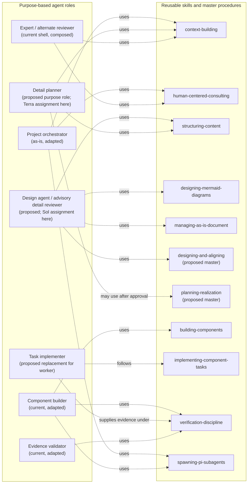

# Sol review — Terra human-gated planning amendments

This is a bounded, read-only advisory review. It does not approve the design, create tasks, or authorize implementation.

## Advisory disposition

All five amendments are directionally consistent with the design’s stated authority, migration, evidence, and human-agency principles. Amendments 1, 3, and 4 are substantive corrections rather than presentation refinements. Amendment 2 requires replacing the multi-file-package default in §5.1. Amendment 5 is a compatible explanatory addition.

### 1. Make human review of Terra plans a distinct gate

The current sequence is insufficiently explicit: G4 moves from a Sol-reviewed detail chunk directly to a kick-off decision. Keep G0–G3, but replace the later overloaded gates with semantic stages:

| Stage | Recommended wording | Permission |
| --- | --- | --- |
| D1 — Detail plan drafted | Terra produces one bounded, traceable, initial implementation-ready plan. | Sol review only. |
| D2 — Detail plan reviewed | Sol reviews the exact plan for design traceability, scope, authority, validation, recovery, and non-goals; at most one bounded Terra repair successor is permitted. | Human review only. |
| D3 — Detail plan human-reviewed | The then-current user reviews the exact Sol-reviewed plan and approves it, requests revision, defers it, or rejects it. Any substantive successor must repeat Sol and human review. | A separate slice kick-off decision only. |
| K1 — Slice kick-off | The user authorizes preparation and task admission for the named slice. | No implementation. |
| T1 — Task authorized | The responsible task-control authority admits the exact holder, scope, tools, budget, dependencies, acceptance evidence, protected inputs, and recovery terms. | Implementation of that task only. |

Add this normative sentence:

> Terra supplies an initial implementation-ready plan, meaning that the plan is sufficiently complete to support review and task admission. “Implementation-ready” describes planning completeness, not authority: the plan is not approved, executable, or itself a task. Implementation begins only after high-level review and alignment, complete base-design approval, human acceptance of the exact Sol-reviewed detail plan, separate slice kick-off, and exact task authorization.

Resolve the current §17 question by defining kick-off as task preparation/admission only, never execution.

### 2. Use one combined human-facing design grounded in current records

This is consistent with the current-versus-target discipline and evidence-gated migration, but conflicts with §5.1’s five-part package as the default. Replace that section’s package proposal with:

> The normal human review unit is one revisioned `target-design.md`, containing the core design followed by appendices for component deltas, migration, setup and benchmark protocol, decision history, and unresolved questions. A minimal `review-manifest.md` identifies the exact reviewed revision and attachments but does not duplicate the design narrative. Separate files are used only where an independently owned canonical base record, machine-consumed artifact, or lifecycle boundary requires them; each such attachment is frozen and referenced from the combined document.

Add a governing delta rule:

> Current `as-is.md` records are the baseline. Every target change is classified as retained, adapted, introduced, deprecated, replaced, dropped, or deferred. An extension beyond current records must identify the unmet capability, owner, consumers, authority and tool implications, compatibility path, validation evidence, and migration or removal gate. Unjustified extensions remain deferred.

Do not flatten separately owned canonical component records merely to obtain a single file; the combined document should present and link their exact frozen revisions through appendices.

### 3. Make workflow benchmark evidence and its limits visible

The benchmark discussion concerns the workflow, not reviewer or model selection. Sections 12–13 already define a workflow-evaluation protocol, but the high-level document should state plainly that no project-specific workflow comparison has run. Add a short section or appendix summary:

> **Workflow benchmark and evaluation — advisory, not authority**
>
> The proposed evaluation compares the pinned current workflow and the candidate workflow on the same controlled feature, using the same separately owned seed, setup conditions, primary model settings, budget, retry policy, deterministic checks, protected fixtures, rubric, and scorer. **No project-specific workflow benchmark has run.** Sections 12–13 describe a proposed protocol, not results or adoption evidence.
>
> The benchmark should measure setup, correctness, scope discipline, human effort, agent operation, integration, evidence quality, design alignment, and recovery. Before execution, record the exact seed, pinned baseline revision, candidate revision, feature, settings, budget, retry policy, checks, protected inputs, rubric, scorer, safety-critical failures, thresholds, and advancement rule. A model or reviewer-selection experiment must be labelled separately; it must not be presented as evidence that one workflow is superior. Human approval remains required for the benchmark protocol and any advancement decision.

Reviewer/model screening is separate and is not part of this workflow benchmark. Do not present the Terra summary or temporary file as durable primary evidence; cite the durable screening record only when discussing reviewer selection.

### 4. Add a focused agent-to-skill view

Place this near the agent/skill disposition sections. It deliberately shows procedure use only, not lifecycle handoffs or authority:

Caption:

> Dashed arrows mean that a role may use or compose a procedure. They do not grant tools, scope, task admission, approval, integration, or completion authority. Sol and Terra are exercise-specific assignments, not architectural role names.

## Contradictions to avoid

- **Do not amend draft 5 in place or call these changes presentation-only.** `review-manifest.md` requires any packet change to produce a successor revision and digest. Gate changes, benchmark claims, and package restructuring require a newly frozen successor and fresh bounded review.
- **Do not conflate D3 with K1.** Human acceptance of the detail plan and human authorization to kick off the slice are separate decisions.
- **Do not let “implementation-ready” imply “authorized.”** Only T1 permits implementation.
- **Do not weaken G3 silently.** The current design defines it as approval of the complete revised system’s base-record inventory, not merely records needed for one slice. Changing that would require an explicit lifecycle decision.
- **Do not imply a benchmark result.** Screening evidence concerns reviewer/model shortlisting; the workflow benchmark remains unrun.
- **Do not treat xAI’s provisional human selection as score leadership or verified family independence.**
- **Do not turn proposed agents or skills into current-state claims.** Mark the design role, detail-planning role, task-implementer replacement, `designing-and-aligning`, and `planning-realization` as proposed until approved and migrated.

This is an advisory review only; it does not approve the design or authorize planning, tasks, or implementation.
