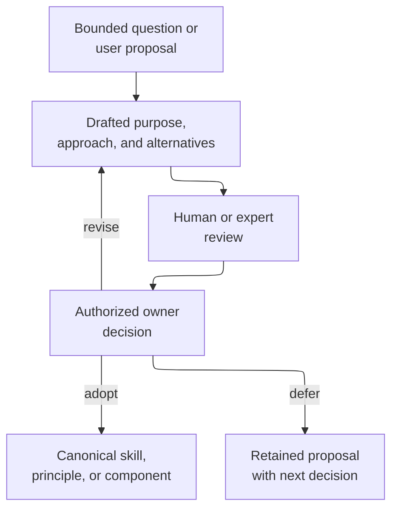

# Drafts - as-is

## Purpose

Provide a durable home for bounded proposals that are not yet adopted as repository-wide principles, operational skills, or implementation components. Drafts preserve the proposed purpose, vocabulary, alternatives, and next decision without silently changing current behavior.

## Design

Drafts separate exploration from current authority while keeping a proposal discoverable and reviewable. The component may contain design drafts, capability proposals, and migration approaches; each draft states whether it proposes documentation, a reusable skill, a master skill, or a later implementation task.

**Lineage**: [as-is](../as-is.md#design) / **Drafts**

### Proposal review flow

Drafts are not task authority, current architecture authority, backlog authority, or runtime configuration. A draft may recommend a future skill or workflow, but an adopted skill remains authoritative only after it is created in the applicable skill component and linked from the live skills catalog. Rejected or superseded drafts remain clearly marked or are removed only after their recovery, audit, consumers, and replacement value have been assessed; an adopted proposal links to its authoritative replacement rather than becoming a second policy source.

## Links

- [Composable skills approach](composable-skills.md) — the current proposal for independently usable skills and master skills that compose them.
- [Root as-is record](../as-is.md#design) — repository-level component map and authority context.
