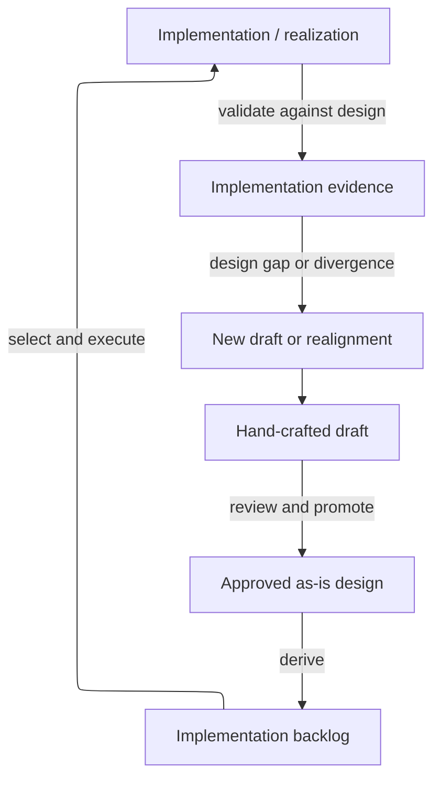
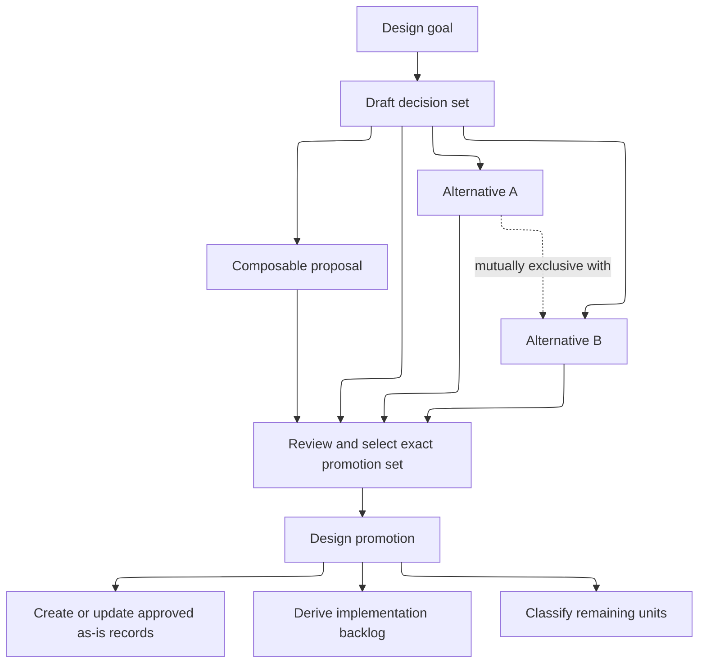

# Composable Skills Approach

> Draft-only design context. This document is hand-crafted planning material; it does not promote a skill, change the live skill catalog, update an `as-is.md`, authorize implementation, or create task authority.

## Purpose

Define a composable set of reusable skills and master skills that helps developers work from approved design rather than treating implementation as a second design authority. The proposal covers skill composition, design drafts, approved desired component design, implementation planning, and bounded realization; it does not cover deployment or applied-environment state.

## Design-state model

The repository should distinguish design approval from implementation without requiring the design to wait for code:

| Artifact | Meaning | Authority boundary |
| --- | --- | --- |
| Draft | Hand-crafted candidate design, alternatives, assumptions, and open decisions. | Planning context only; it is not approved design, task authority, or implementation authority. |
| `as-is.md` | Approved desired design for a component. | Canonical design authority; it may describe architecture, behavior, contracts, visual design, accessibility, or other approved facets before implementation exists. |
| Backlog item | Proposed work to realize an approved design. | Planning index only; it does not approve design or indicate active execution. |
| Task record | Active implementation state, evidence, recovery, and acceptance. | Current task authority for the bounded implementation. |
| Implementation | Machine-readable or machine-processable realization of the approved design. | Evidence of realization; it must not silently choose or redefine the design. |

The intended flow is:

```text
hand-crafted draft → approved as-is design → implementation backlog → implementation
```

If implementation exposes a design gap or divergence, it returns to a new draft or realignment decision rather than silently rewriting the approved design. Deployment and applied-environment state are outside this proposal.

### Design-to-realization flow



## Draft sets and promotion

A draft document may contain several independent or competing design units. Alternatives for one goal are mutually exclusive until a decision selects one; composable proposals may be selected together only when their dependencies and boundaries permit it. Filenames, ordering, or status words such as `latest` do not select a design.

Promotion selects an exact, compatible set of draft units. It may create new component records, update several materially affected `as-is.md` records, and derive implementation backlog items before any implementation exists. Partial promotion is allowed: promoted units leave the open draft set, while unpromoted, rejected, superseded, or deferred units remain explicitly classified.

Promotion is a design handoff, not implementation completion. It does not remove implementation backlog items, write an implementation changelog entry, or claim that implementation exists. A later implementation task consumes the promoted `as-is.md` records and validates realization against them.

### Parallel proposals and promotion



A cross-component proposal may keep one coordinating draft with local impact notes or links. Separate draft material at an impacted level is justified only when that level owns a distinct design decision, boundary, migration concern, acceptance condition, or recovery obligation. The proposal is not copied mechanically through every ancestor.

## Skill name

**Composing Skills**

This name describes the proposal's central property: small skills remain useful on their own, while larger master skills compose them into complete workflows. It avoids implying that every skill is atomic or that users must manually assemble workflows.

## Approach

### Two levels of skill

**Reusable skills** are independently usable procedures with one primary capability. The candidate list below is non-exhaustive; each candidate requires separate evidence for its structure, owner, name, independent consumer, and validation before it becomes a repository skill. Examples include building context, resolving scope, identifying an owner, applying a bounded edit, writing code, writing tests, running tests, validating a change, recording evidence, locating a changelog, designing a diagram, rendering a diagram, delegating bounded work, observing delegated work, and preparing a scoped commit.

**Master skills** compose reusable skills into an outcome-oriented workflow. The candidate list below is non-exhaustive and is not an adoption decision. Examples include building a component, making a general change, maintaining a component, managing as-is records, managing a backlog, managing a changelog, spawning subagents, exploring execution evidence, consulting a human, and committing completed work. A master skill selects the path, orders the work, enforces required gates, handles optional policy, and defines recovery. Users invoke the master skill or request the outcome; they do not need to assemble the underlying skills manually.

### Master-first selection and composition

A proposed workflow would start by identifying the desired outcome and selecting the best-fit master skill. It would not begin by choosing an isolated reusable skill and attempting to assemble a workflow from the outside. The selected master skill would own the composition: it would resolve the applicable scope and policy, choose a named composition variant, prefer the reusable skills needed by that variant, enforce ordering and gates, and define recovery and stopping rules.

A master skill may contain several compositions for materially different paths. For example, `making-changes` may select a component-task composition or a non-component composition after resolving scope and task applicability:

| Composition | Preferred reusable skills | Required distinction |
| --- | --- | --- |
| Component-based change | `resolving-scopes` → `identifying-owners` → `building-context` → `choosing-change-methods` → `implementing-tasks` → `writing-code` or `applying-bounded-edits` → `writing-tests` → `validating-changes` → `locating-changelogs` → `managing-changelogs` | Preserve the component task protocol, descendant closure, owning changelog, backlog reconciliation, task cleanup, and scoped completion handoff. |
| Non-component change | `resolving-scopes` → `identifying-owners` → `building-context` → `choosing-change-methods` → `writing-code` or `applying-bounded-edits` → `writing-tests` when useful → `validating-changes` → `locating-changelogs` → `managing-changelogs` when required | Do not create a component task merely because a reusable skill or nearby component exists; resolve the applicable artifact, project, or root authority and history contract. |

The arrows show a master-selected preference order, not mandatory activation of every skill. A master may omit a skill when its contract does not apply, but it must state why, preserve required gates, and stop when the applicable owner or contract is unresolved. Reusable skills remain directly usable for focused requests, but agents should prefer the selected master composition for an outcome-sized workflow.

### Agent integration and skill choice

Agent contracts would need review as part of a future adoption, but not by replacing their authority with a skill registry. A future migration could have each agent name the master skills it can perform or support, the composition variants it may use, and the reusable skills available within those compositions. The front-face router could classify the requested outcome and select an admitted agent plus best-fit master skill first; the receiving agent could then select the composition variant and preferred reusable skills. Role descriptions, task records, permissions, and configured admission would remain authoritative. Skill descriptions would establish fit, not permission.

This proposal does not change current agents. If adoption is approved, a later bounded planning and implementation task would need to define the compatibility approach, review the router, component-builder, and specialized agents, preserve current skill references during transition, and specify routing tests for master-first selection and component/non-component variants. No agent would be required to manually activate every underlying skill, and no proposed master would silently authorize work that the agent or task protocol cannot authorize.

### Agent tool access for compositions

A skill does not grant tools. Before an agent is admitted to a master skill or composition, the composition's required tool set must be compared with the agent's declared tools, permissions, and authority. The agent must have every tool needed for its selected path, or the workflow must stop with a bounded missing-capability blocker; it must not silently substitute a weaker tool, broaden permissions, or ask a read-only agent to perform mutation.

A future adoption plan should define a tool-access matrix alongside each master composition:

| Composition capability | Minimum tool class | Access rule |
| --- | --- | --- |
| Building context and resolving scopes | Read-only repository inspection and approved linked-context resolution | The agent can inspect only the authorized scope and named dependencies; linked content remains reference material, not authority. |
| Writing code or applying bounded edits | Read plus the narrowly authorized edit/write capability | Mutation access belongs only to an agent whose role and task authority permit the selected change; focused editing must not imply code-generation authority. |
| Running tests and validating changes | Approved bounded execution or fixed-check capability plus read-only result inspection | The agent can run only checks permitted by its role and task; validation evidence does not grant completion authority. |
| Managing changelogs and backlogs | Read/write access to the owning durable records plus the applicable procedure | Record mutation remains with the owning component or task authority; proximity to a record is not sufficient. |
| Delegating or observing work | The approved delegation or bounded observation tools for the role | Delegation, recovery, cancellation, and observation remain role/orchestrator authority and are never inferred from a skill reference. |
| Preparing or committing completed work | Bounded Git inspection and the authorized commit procedure | Staging and commit access requires completion gates and scoped ownership; a composition cannot grant commit authority. |

For the two `making-changes` variants, the component-based path would normally require context inspection, linked-context resolution, bounded mutation, relevant checks, durable-record access, and—when completion is authorized—delegation and scoped Git handoff capabilities. The non-component path would require only the tools needed for its resolved artifact, project, or root scope and applicable history contract; it must not inherit component-task or commit tools merely because they exist in another composition. Advisory, evidence-validator, and router agents should receive read-only or routing tools only and must not be admitted to mutation-capable compositions.

The future migration should test both positive and negative access cases: an agent with the complete required tool set can select the composition; an agent missing one required tool is blocked before work begins; a tool present in metadata but denied by permission is treated as unavailable; and a reusable skill invoked directly cannot bypass the selected agent's tool or authority boundary. This is a planning requirement, not a current change to agent front matter, permissions, or runtime admission.

### Proposed size and migration coverage

The repository currently has no enforced 2,000-character limit for `SKILL.md` files. One existing agent contract has a separate 2,000-byte compactness check, but that is not a skill-size rule and remains unchanged by this proposal. For planning purposes, a future reusable skill may target at most 2,000 characters when that is enough to state its independent contract; a master skill may need to be larger because it carries compositions, gates, recovery, and stopping rules. The final unit, limit, enforcement point, and exceptions require an adoption decision and must not be implemented from this draft alone.

The 25 proposed reusable skills are not a one-for-one replacement catalog. Approximately 12 have direct or near-direct coverage in the 17 currently implemented skills, including context building, component building, task implementation, component maintenance, as-is record management, Mermaid design, backlog management, subagent spawning, execution-evidence exploration, human consultation, scoped commits, and naming or content structuring. Approximately 6 are partial extractions from existing procedures, including validation, evidence recording, execution inspection, ownership, changelog location, and delegation or observation. Approximately 7 would be new or materially separated capabilities, including writing code, applying bounded edits, resolving scopes, choosing change methods, writing tests, running tests, and preparing independent changelog entries. These are planning estimates, not migration decisions; each proposed skill requires an owner, consumer, compatibility path, and focused validation before creation or replacement.

### Change scope resolution

A future general change workflow would first resolve the smallest valid scope and would not assume a component task. This is a proposed pilot contract, not current authority. Until an approved implementation establishes who decides task applicability, scope ownership, and the applicable history contract, unresolved cases stop for explicit direction rather than being reclassified as taskless. Scope may be:

- a documented component with a component task;
- an artifact or project scope without a component task; or
- the repository root when the change is genuinely root-owned.

Component identification is therefore a reusable capability, not a universal prerequisite. If ownership or scope is ambiguous, the workflow stops and asks for direction rather than choosing by path proximity alone.

### Writing code and editing artifacts

Writing code and applying a bounded edit are separate capabilities. `writing-code` supports new or substantially generated implementation from a bounded requirement. `applying-bounded-edits` makes surgical changes to existing artifacts while preserving unrelated content. A master skill chooses between them according to the change, scope, and risk. Other capabilities may include drafting content, creating an artifact, refactoring code, updating documentation, and repairing a failing test when those distinctions provide independent reuse.

### Changelog resolution

Changelog management is independently usable and does not depend on a component task. A future history workflow would resolve the appropriate changelog under the governing task and history contract, using explicit configuration, the owning component or project record, or an applicable repository convention as evidence. It must not select a changelog merely because it is the nearest file with that name. Where no applicable durable-history requirement exists, the result must be explicitly recorded as no history required rather than inferred.

A non-component change may therefore use:

```text
resolving-scopes → building-context → writing-code or applying-bounded-edits → validating-changes → locating-changelogs → managing-changelogs
```

A component task that reaches completion still follows the repository's existing task protocol: acceptance validation, terminal descendant closure, concise owning changelog summary, exact backlog reconciliation where applicable, task-artifact cleanup, and the scoped completion handoff remain required. Omitting changelog management is valid only for work whose applicable contract does not require durable history, such as an explicitly exploratory or non-completing result.

### Master workflow examples

```text
making-changes = resolving-scopes → building-context → choosing-change-methods → writing-code or applying-bounded-edits → validating-changes → managing-changelogs when required
```

```text
building-components = resolving-scopes → building-context → implementing-tasks → writing-code or applying-bounded-edits → writing-tests → validating-changes → managing-changelogs → preparing-scoped-commits
```

```text
exploring-execution-evidence = building-context → inspecting-execution-evidence → recording-evidence
```

The arrows describe a proposed composition, not a new runtime engine. Existing task, backlog, changelog, delegation, and commit authorities remain authoritative until a later approved implementation changes them.

## Proposed reusable skills

Each proposed reusable skill is described separately so its responsibility and procedure can be reviewed without scanning a wide comparison table. Per-skill Design-view diagrams were removed from the briefs after the round-2 benchmark A/B (arms that authored Mermaid design views underperformed on all gates; user authorized the drop 2026-09-01). Design views remain draft-level where they explain the approach itself. These names and contracts remain proposals; existing skills remain authoritative until an approved migration task changes them.

### `building-context`

**Purpose**: Assemble the smallest authoritative context for a bounded decision or handoff.

**Approach**: Identify the decision, gather authoritative records and direct evidence, and stop when the context is sufficient without widening scope.

**How it should be done**: State the question and stopping condition; read the owning record, applicable contract, acceptance conditions, and named dependencies; label facts, assumptions, and unknowns; preserve source links; escalate conflicts instead of filling gaps from proximity.


### `resolving-scopes`

**Purpose**: Resolve component, artifact, project, or root scopes without assuming a component task.

**Approach**: Classify the requested change, locate the smallest owning scope, and stop for explicit direction when ownership or task applicability is ambiguous.

**How it should be done**: Identify the requested outcome and changed artifact; inspect component records and ownership contracts; test component-task applicability; choose component, artifact, project, or root scope; record the decision; stop on competing owners or missing policy.


### `identifying-owners`

**Purpose**: Identify the authorities and owners for the resolved scopes.

**Approach**: Trace each concern to its canonical owner and separate authority, consultation, and implementation responsibilities.

**How it should be done**: Build a concern-to-owner table for implementation, task state, durable records, history, validation, delegation, and commits; verify each owner from a record or contract; distinguish who may advise, edit, authorize, and integrate.


### `locating-changelogs`

**Purpose**: Resolve the changelogs owned by the target scopes.

**Approach**: Use explicit ownership records and applicable history contracts before considering repository conventions; never select by proximity alone.

**How it should be done**: Read the task, component, project, or root history contract; resolve configured filenames and owning records; determine whether history is required; return the exact path and rationale, or explicitly record that no history is required.


### `choosing-names`

**Purpose**: Select semantically accurate names using local conventions.

**Approach**: Inspect the concept's parent, siblings, and naming guidance, then choose the narrowest accurate name and record material departures.

**How it should be done**: Identify the concept's responsibility and lifecycle; inspect parent and sibling names; consult naming guidance; compare alternatives for semantic precision and discoverability; choose one name; update proven references atomically when renaming.


### `structuring-content`

**Purpose**: Choose a durable location, hierarchy, and representation.

**Approach**: Shape content around reader goals, ownership, discoverability, and lifecycle while preserving existing structural conventions.

**How it should be done**: Identify the reader and retrieval question; inspect the containing structure; choose the smallest meaningful location and representation; keep authority with the owning record; preserve navigation and lifecycle; assess moves before changing existing content.


### `drafting-content`

**Purpose**: Produce a bounded proposal without claiming adoption or completion.

**Approach**: State purpose, alternatives, assumptions, boundaries, and next decision while keeping proposal content separate from current authority.

**How it should be done**: Write the proposed outcome, rationale, scope, alternatives, dependencies, risks, acceptance, and next decision; label it as draft; avoid operational instructions that pretend adoption; route approval to the authority-bearing owner.


### `writing-code`

**Purpose**: Create or substantially implement code from a bounded requirement.

**Approach**: Translate an authorized requirement into new or substantially generated implementation, then hand the result to focused testing and validation.

**How it should be done**: Read the requirement, interfaces, constraints, and nearby patterns; define changed artifacts and acceptance mapping; implement the smallest coherent path; preserve ownership and error behavior; return the diff for testing and validation rather than claiming completion.


### `applying-bounded-edits`

**Purpose**: Make surgical changes to existing artifacts.

**Approach**: Inspect consumers and surrounding conventions, make the smallest reversible replacement, and preserve unrelated content and authority.

**How it should be done**: Confirm the exact target and literal transformation; inspect consumers and nearby context; use a precise replacement; review the diff for collateral changes; run focused checks; stop if the target, owner, or transformation is ambiguous.


### `writing-tests`

**Purpose**: Add or update focused coverage for a stated behavior.

**Approach**: Map each test to an acceptance condition or risk, choose the smallest relevant test level, and document residual gaps.

**How it should be done**: Name the behavior and failure risk; choose unit, integration, fixture, or live coverage; write deterministic success and boundary cases; avoid testing implementation details without contract value; record uncovered conditions and why.


### `running-tests`

**Purpose**: Run the smallest relevant test or check and return observations.

**Approach**: Select checks from the changed behavior and acceptance conditions, execute them without broadening scope, and report results and limitations.

**How it should be done**: Map changed artifacts to existing focused checks; run the narrowest applicable command; capture pass, failure, skip, timeout, and environment status; do not reinterpret process exit as completion; recommend the next bounded check when evidence is insufficient.


### `validating-changes`

**Purpose**: Map observable evidence to acceptance conditions and residual risk.

**Approach**: Compare collected evidence with each acceptance condition, distinguish pass from unsupported claims, and record remaining risk.

**How it should be done**: Create an acceptance-to-evidence matrix; inspect the actual diff and test results; mark each condition passed, failed, blocked, or untested; separate observations from inferences; record residual risk, recovery, and commit readiness.


### `recording-evidence`

**Purpose**: Preserve observations, provenance, assumptions, and validation results.

**Approach**: Capture concise, reproducible evidence with its source, interpretation, uncertainty, and relationship to the authorized decision.

**How it should be done**: Record selector, source, timestamp or revision, command or observation, result, interpretation, and limitation; keep secrets and unbounded payloads out; link evidence to the requirement without granting it authority.


### `designing-diagrams`

**Purpose**: Design bounded reader-oriented visual explanations.

**Approach**: Select a diagram type and symbols that explain the intended relationships while keeping source, navigation, and ownership accurate.

**How it should be done**: Define the reader question and view boundary; choose functional nodes and canonical relationships; include only supported context; design labels and layout for scanning; provide source and expected navigation targets for validation.


### `rendering-diagrams`

**Purpose**: Render and inspect diagrams when rendering is material.

**Approach**: Use the available renderer, inspect the output and expected links, and report unsupported renderer capability separately from source validity.

**How it should be done**: Validate source syntax first; render through the approved local capability; inspect geometry, labels, links, and expected hrefs; distinguish renderer-unavailable from source-invalid; retain source-level evidence when rendering cannot run.


### `inspecting-execution-evidence`

**Purpose**: Investigate bounded traces, sessions, or execution results.

**Approach**: Read only the authorized evidence surface, correlate bounded events, and distinguish observations from inferred causes or authority.

**How it should be done**: Require an exact selector and focused question; read the smallest bounded trace or session slice; correlate event names and timing; report observed facts, hypotheses, unknowns, and freshness; never use evidence to authorize work or completion.


### `assessing-determinism`

**Purpose**: Identify evidence-supported deterministic improvements.

**Approach**: Compare repeated behavior and inputs, isolate nondeterministic sources, and recommend only changes supported by observed variance.

**How it should be done**: Classify steps as policy, transformation, observation, or judgment; compare bounded repetitions; quantify relevant variance and benefit; preserve intentional generative behavior; recommend retention, a bounded backlog item, or an explicitly authorized task.


### `recording-backlog-items`

**Purpose**: Prepare bounded backlog proposals for the owning backlog procedure.

**Approach**: Define one outcome, scope, acceptance, dependencies, preferences, and residual notes without selecting or claiming the work.

**How it should be done**: Write one uniquely named item with purpose, description, owner, scope, acceptance, dependencies, user/system preferences, and notes; use fully qualified dependencies; leave status selection and completion to backlog authority.


### `drafting-changelog-entries`

**Purpose**: Prepare concise history entries for the owning changelog procedure.

**Approach**: Summarize the durable result, evidence, scope, and residual risk without replacing the owning changelog or completion protocol.

**How it should be done**: Wait for validated completion evidence; name the task or change identity; summarize result and checks; state residual risk and source commits where applicable; let the owning procedure decide placement and cleanup.


### `delegating-bounded-work`

**Purpose**: Prepare a bounded child handoff without transferring authority implicitly.

**Approach**: Define the child outcome, scope, budget, context, acceptance, and return contract while retaining parent authority and ownership boundaries.

**How it should be done**: Verify the child boundary and configured worker; provide explicit linked context, budget, acceptance, changed-artifact boundary, recovery checkpoint, and return format; record the delegation; do not delegate parent authority or sibling files.


### `observing-delegated-work`

**Purpose**: Observe delegated progress, results, budgets, and terminal status.

**Approach**: Read approved progress and evidence surfaces incrementally, report blockers and outcomes, and avoid directing work outside granted authority.

**How it should be done**: Use the approved handle, task record, logs, traces, or session selectors; read incrementally; compare progress with acceptance and budget; classify running, blocked, failed, or terminal; preserve the worker's scope and do not infer completion.


### `preparing-scoped-commits`

**Purpose**: Prepare authorized validated changes without staging unrelated work.

**Approach**: Separate the declared handoff, inspect the staged patch, run required checks, and stop when scope or completion authority is missing.

**How it should be done**: Confirm acceptance and descendant closure; identify declared artifacts; stage only the changelog, exact backlog cleanup, task cleanup, and handoff; inspect staged diff and `git diff --cached --check`; commit once with repository message style.


### `presenting-decisions`

**Purpose**: Present bounded decisions, alternatives, uncertainty, and recommendations.

**Approach**: Frame the decision with evidence, trade-offs, unresolved questions, and an explicit request for the authority-bearing choice.

**How it should be done**: State the decision needed first; present evidence, options, benefits, costs, risks, assumptions, and unknowns; recommend only when justified; identify the authority-bearing decider; stop without treating advice as approval.


### `choosing-change-methods`

**Purpose**: Select appropriate change capabilities for bounded scopes and risks.

**Approach**: Choose code generation, bounded editing, content work, delegation, or another capability from the requirement, scope, and risk rather than habit.

**How it should be done**: Classify the requested transformation as new implementation, surgical edit, content drafting, test work, delegation, or maintenance; verify required tools and permissions; choose the least powerful fitting method; stop when no method is authorized.


## Proposed master skills

Each proposed master skill composes reusable capabilities into an outcome-oriented workflow. A master skill owns selection, ordering, gates, optional paths, recovery, and stopping rules; it does not transfer authority from agents, task records, component records, backlogs, or changelogs.

### `making-changes`

**Purpose**: Make and validate general changes with the smallest applicable scopes and history treatments.

**Approach**: Resolve scope and ownership, choose the change method, compose the needed reusable skills, validate the result, and resolve durable history when required.

**How it should be done**: Select this master from the requested outcome; resolve component versus non-component scope first; choose the matching composition variant; verify tools and permissions; compose only applicable skills; enforce validation and history gates; stop on unresolved ownership or task applicability.


### `building-components`

**Purpose**: Build bounded component tasks with delegation, validation, history, and completion handoffs.

**Approach**: Build context, authorize the component task, delegate bounded work where useful, enforce acceptance and descendant gates, and prepare the owning completion handoff.

**How it should be done**: Read the component record and authorized task; build decision context; obtain required plan review; stop at child boundaries; delegate only through configured workers; implement, test, validate, close descendants, write history, reconcile backlog, clean task artifacts, and prepare the scoped commit.


### `implementing-tasks`

**Purpose**: Run the existing task lifecycle for authorized bounded requirements.

**Approach**: Follow task applicability, start, execution, recovery, validation, descendant closure, changelog, backlog, and completion procedures without changing their authority.

**How it should be done**: Verify an active authorized task before editing; record scope, acceptance, worker, budget, dependencies, checkpoints, and changed artifacts; update progress and recovery evidence; require acceptance and terminal descendants; hand completion to history, cleanup, and commit procedures.


### `maintaining-components`

**Purpose**: Inspect and apply the smallest evidence-supported component improvements.

**Approach**: Audit a bounded component against applicable records and conventions, fix confirmed issues only, validate the change, and preserve ownership and recovery boundaries.

**How it should be done**: Define the component and maintenance signal; inspect records, consumers, and conventions; distinguish confirmed defect from preference; propose or apply the smallest authorized fix; validate structure and behavior; record retained exceptions and residual risk.


### `managing-as-is-records`

**Purpose**: Create, align, and navigate durable component records.

**Approach**: Resolve component context, apply the record contract, update relationships and navigation, validate content and diagrams, and preserve canonical ownership.

**How it should be done**: Identify the component boundary and parent; read the record contract; create or revise Purpose, Components, Design, Relationships, and navigation; keep task state out; validate links, diagrams, and child parity; stop when ownership is unclear.


### `designing-mermaid-diagrams`

**Purpose**: Produce bounded Mermaid views and validate their syntax and rendering when needed.

**Approach**: Design the reader-oriented view, preserve navigational hrefs, run source checks, render when available, and report renderer limitations explicitly.

**How it should be done**: Define the reader question and diagram scope; choose a supported view and canonical labels; write linked Mermaid source; check structure and hrefs; render only when material; inspect output; report source and renderer evidence separately.


### `managing-backlogs`

**Purpose**: Maintain planning indexes and perform evidence-gated reconciliation.

**Approach**: Add or revise bounded items, calculate priority and dependencies, reconcile only authorized transitions, and remove completed rows only with changelog evidence.

**How it should be done**: Use the owning backlog schema; record one bounded item with exact identity, preferences, dependencies, acceptance, and notes; query ordering; apply only authorized transitions; clean a completed row only after exact changelog evidence.


### `managing-changelogs`

**Purpose**: Resolve and maintain durable histories independently of component-task use.

**Approach**: Locate the owning history from explicit contracts, write concise evidence-backed entries, and state when no durable history is required.

**How it should be done**: Resolve history from task, component, project, or root contracts; verify the result is durable and owned; write a concise dated or convention-compliant summary with evidence and residual risk; explicitly record no-history outcomes.


### `spawning-subagents`

**Purpose**: Launch, observe, recover, and hand off bounded delegated work under existing authority.

**Approach**: Build a bounded handoff, launch through the approved host path, observe progress and evidence, enforce budgets and recovery, and retain parent authority.

**How it should be done**: Verify role admission, worker configuration, component boundary, budget, and task state; construct explicit context and return conditions; launch through the approved adapter; observe bounded handles and evidence; recover or stop without inferring completion.


### `exploring-execution-evidence`

**Purpose**: Investigate bounded execution evidence and produce a cautious finding.

**Approach**: Build the smallest evidence context, inspect readable traces or sessions, correlate observations, and report findings without granting execution or task authority.

**How it should be done**: Require a focused question and exact selector; read only permitted trace/session evidence; correlate bounded events; label observations, inferences, and unknowns; return a finding and recommendation; never edit, launch, authorize, or treat telemetry as task state.


### `consulting-humans`

**Purpose**: Guide bounded decisions while preserving human agency.

**Approach**: Present the decision, evidence, alternatives, uncertainty, and recommendation, then stop for the authorized human choice.

**How it should be done**: Clarify only material questions; state the decision and context; present a small set of evidence-backed options and trade-offs; identify uncertainty and professional authority where relevant; recommend without deciding or executing.


### `committing-completed-work`

**Purpose**: Verify completion gates and prepare scoped durable handoffs.

**Approach**: Confirm acceptance and descendant closure, stage only the changelog, exact backlog cleanup, task cleanup, and declared handoff, then verify and commit once.

**How it should be done**: Verify completion eligibility and descendant closure; obtain exact cleanup evidence; stage only declared files; inspect cached diff and whitespace; commit with established style; verify the commit and leave unrelated work untouched.


## Design constraints

- Users select outcomes or master skills; they do not need to activate each reusable skill manually.
- Reusable skills remain independently usable for focused work, testing, review, and reuse by more than one master skill.
- Composition does not transfer authority. Task status, component records, backlog state, changelog ownership, delegation, and commits remain with their existing owners.
- Every workflow chooses the smallest applicable scope and may proceed without a component task when the change does not require one.
- Every consequential change has an explicit validation path and states residual risk.
- A master skill may omit changelog handling only when the applicable work contract explicitly permits no durable history; component-task completion retains the current changelog requirement.
- Existing repository behavior is not changed by this proposal. Adoption requires a separate bounded implementation and migration decision.

## Reserved for later

The following are deliberately deferred until the composition approach has been adopted and real consumers demonstrate a need:

- machine-readable skill metadata;
- formal `requires`, `produces`, `effects`, or dependency schemas;
- a skill registry or composition engine;
- automated ordering and compatibility checks;
- generic workflow profiles or a universal task abstraction;
- replacing all current operational skills with newly split files;
- a global rule that every change must use a component task;
- a global rule that every change must update a changelog.

The current proposal remains readable from the skill names, purposes, approach, examples, and design constraints. Future metadata must remain a compact aid to composition and must not duplicate the authoritative skill, task, component, backlog, or changelog contracts.

## Status and next decision

This is a proposal in the root `drafts` component. It is not a live skill catalog, repository-wide policy, task authority, or implementation plan. The next decision is whether to approve a bounded pilot that adds one general master workflow and a small set of reusable skills while preserving current skill contracts and validating component and non-component changes separately.
