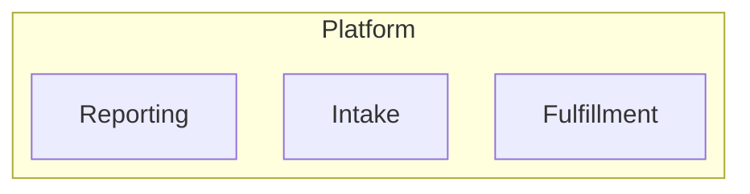
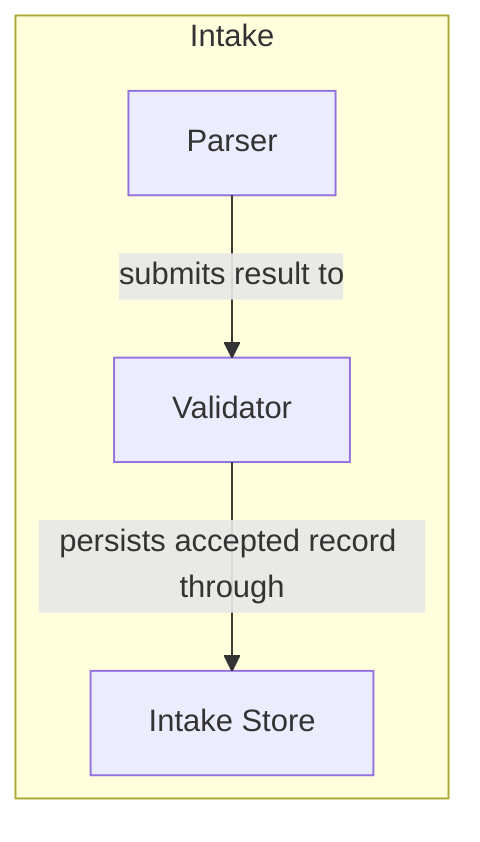
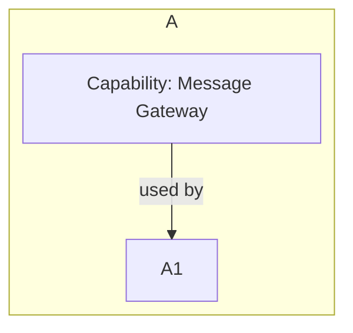
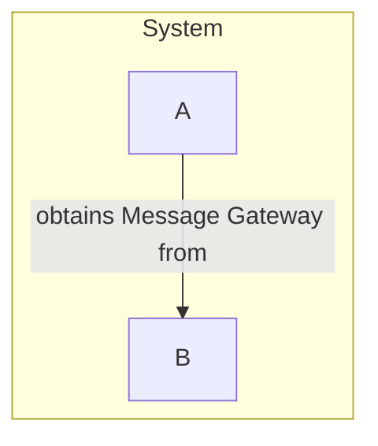
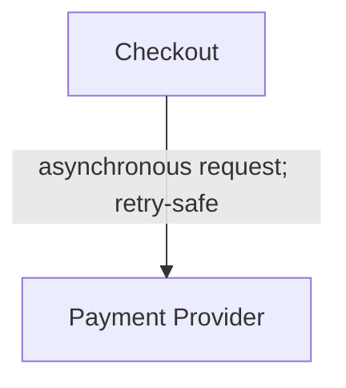
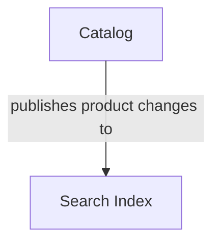
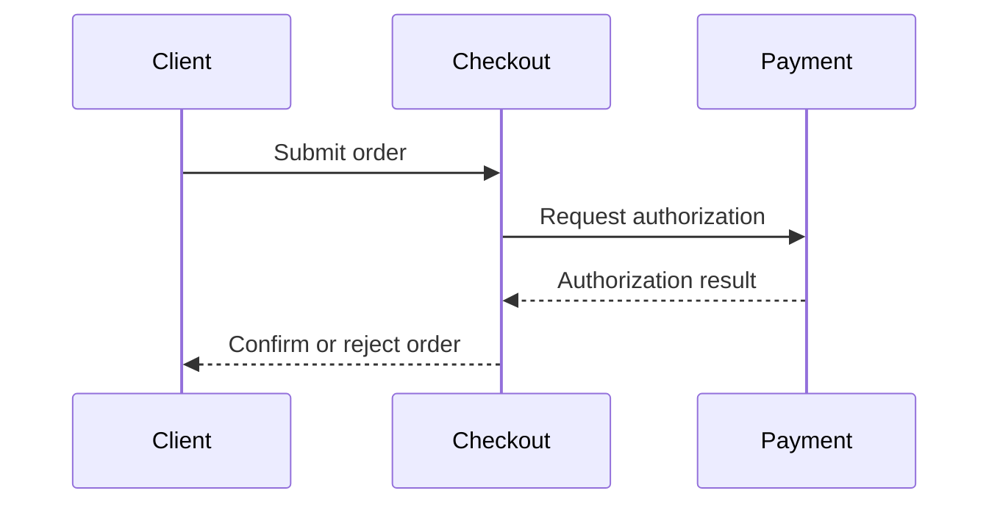
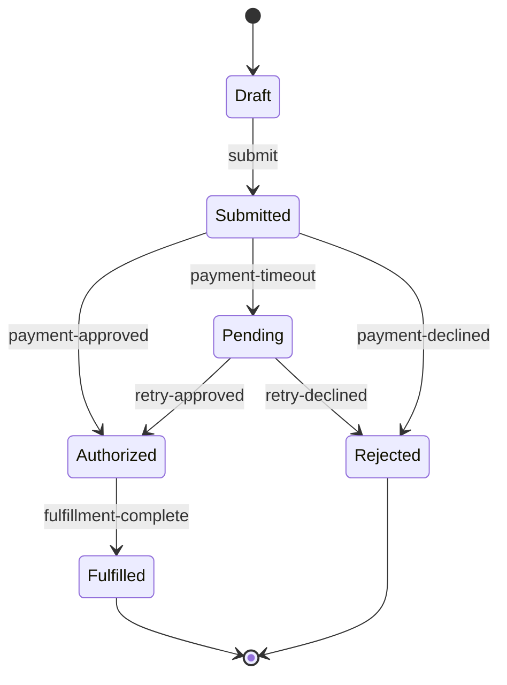
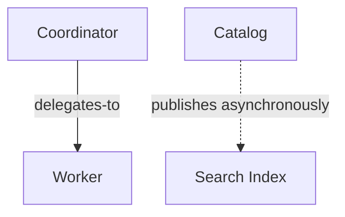
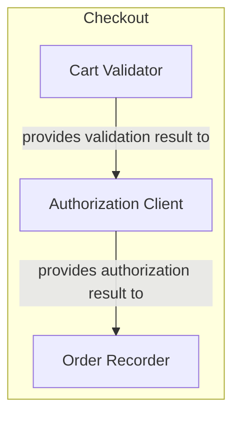

# Hierarchical Component Documentation Design

## Status

Working design proposal captured from a design discussion. This document is a
standalone concept document and uses abstract examples only; it does not
describe or model this repository.

## Summary

Document a large system as a hierarchy of bounded components. Each component
has a name, purpose, boundary, and (where useful) child components. A diagram
shows one component and its immediate children, with labeled relationships among
those visible nodes. Readers progressively disclose detail by navigating to a
child component's own document.

The hierarchy is the primary navigation and ownership structure. Diagrams and
their accompanying design descriptions are authoritative architecture
artifacts. Source code, configuration, tests, and generated visual outputs must
align with them; they are implementation or evidence unless explicitly made
part of the design.

The design is intended to reduce interpretation cost for both humans and LLMs:
start with a bounded local view, preserve stable names and relationships, and
reveal implementation detail only at the level where it is needed.

## Design principles

### 1. Hierarchy represents ownership and composition

A parent component contains or composes child components. The component
boundary is defined by the directory containing its `as-is.md` record, so a
separate boundary section is not required merely to restate that directory.
Containment is not a labeled edge: it is represented visually by placing child
boxes inside the parent box. A child has its own purpose and boundary. The
hierarchy is not required to represent every runtime relationship in the
system.



A component document for `Intake` would show `Intake` and its immediate
children, not the complete platform. When a component is rendered in another
diagram, its displayed name should link to the target record's diagram section,
normally `as-is.md#design`, rather than only to the component directory. The
rendered SVG should preserve that link so selecting the component opens its
detailed architecture context.

### 2. Diagrams are local, bounded views

A diagram should display no more than two hierarchy levels: one parent and its
immediate children. It may show relationships among those visible nodes. It
should not expand arbitrary descendants merely to expose a distant dependency.



The `Parser` document separately shows the parser and its own children. This
keeps each view readable and gives an LLM a predictable retrieval unit.

### 3. A child depends on its parent-facing capability, not hidden providers

If `A1` is inside `A`, and `A` needs a connection to `B`, do not render `B` in
`A1`'s diagram. `A1` knows only `A` or a capability exposed by `A`. The
connection between `A` and `B` is documented at their common parent level.



At the parent level, the provider relationship is visible:



`A1` does not acquire or name `B`. `A` owns composition and dependency
acquisition. This is compatible with dependency injection, but does not require
that implementation technique.

When provider identity is not relevant at a level, use a role or function such
as `External Service`, `Environment`, or `Message Gateway`. Reveal the concrete
identity only where it changes an architectural decision, such as trust,
security, data ownership, deployment, cost, compliance, availability, or
performance.

### 4. The abstraction must preserve meaningful constraints

Hiding a provider is useful only when the hidden identity is not relevant to the
view's purpose. The design description should still state the required
capability and any constraint that matters at the boundary.

```markdown
## Dependency contract

`A1` requires `MessageGateway.send(message)`. `A` supplies an implementation
through composition. `A1` is not coupled to the provider identity. Delivery
must be authenticated and may fail without affecting local validation.
```

The abstraction conceals identity while retaining the contract and important
failure or authority semantics.

### 5. Runtime behavior is disclosed at the level where it matters

Most implementation mechanics belong in leaf-level documents. However, a
runtime fact must be projected to a higher level when it changes the meaning of
a visible boundary or relationship.



The leaf-level document can explain queues, retries, idempotency keys, and
payloads. The parent view still identifies the interaction as asynchronous and
retry-safe because those facts affect the architecture. Details that do not
change the visible contract remain at the leaf.

Rule:

> Keep mechanics at the leaf, but expose cross-boundary behavior at the level
> where the boundary is visible.

### 6. The diagram is authoritative

The diagram defines the documented architecture. The design text explains its
meaning, rationale, constraints, and permitted extensions. Text must align with
the diagram rather than silently introducing contradictory relationships.



The accompanying text may extend the diagram:

> Catalog publishes changes asynchronously. The index may be temporarily stale;
> Catalog remains the owner of product truth.

It must not claim that `Index` writes authoritative catalog data unless the
architecture diagram is changed accordingly.

Source code is evidence of realization and can reveal architectural drift. A
new cross-component relationship that is absent from the authoritative diagram
is a design defect, an explicitly permitted implementation detail, or a change
that requires updating the design.

### 7. Granularity is a user decision

The documentation system should provide naming and decomposition guidance, not
an automatic definition of the correct component size. Create a documented
component when the distinction helps explain purpose, ownership, change,
interaction, lifecycle, or responsibility.

```markdown
# Recommendation Engine

## Purpose

Selects ranked recommendations for a customer context.
```

Whether ranking, feature extraction, and candidate selection become child
components is a design decision. They should not be split merely because they
are separate classes or files.

### 8. Separate structure from flow

The hierarchy and component diagrams describe relatively stable structure. A
flow describes behavior over time in a selected scope. A flow may reference
components, but need not reproduce the hierarchy.

Key or complex flows are documented explicitly. Other flows are assumed to
follow the standard behavior of their abstractions or components unless a
specific exception is recorded. For example, ordinary HTTPS transport is not
redocumented in every application flow, and firewall behavior is represented by
the firewall component rather than repeated in each downstream flow.

This is progressive disclosure, not a claim that hidden behavior is
irrelevant: a standard flow becomes visible when it has an architectural
exception, security implication, failure mode, or other consequence that
changes the reader's understanding.



The flow is scoped to the visible participants. A more detailed flow can be
created inside `Checkout` without exposing its internal implementation in the
system-level flow.

## Flow documentation

### Flow categories

Document key or complex flows in detail. Assume standard flows under their
abstractions or components; document an assumed flow explicitly only when it
departs from the standard or when the assumption materially affects a design
decision.

Use the smallest flow type that explains the behavior:

| Flow type | Documents | Typical representation |
|---|---|---|
| Scenario flow | A user or operational journey | Ordered Markdown steps plus sequence diagram |
| State flow | Lifecycle states and legal transitions | State diagram plus transition table |
| Data flow | Movement and transformation of information | Vertical flowchart or data-flow diagram |
| Decision flow | Guards, branches, and outcomes | Decision table or flowchart |
| Recovery flow | Failure, retry, escalation, and compensation | Ordered steps plus failure paths |

### Scenario flow template

```markdown
# Submit Order

## Scope

`Commerce Platform`; visible participants are `Customer`, `Checkout`, and
`Payment`.

## Trigger

The customer submits a valid cart.

## Preconditions

- The cart is available.
- Checkout can obtain a payment capability.

## Steps

1. `Checkout` validates the cart.
2. `Checkout` requests authorization from `Payment`.
3. `Payment` returns an authorization result.
4. `Checkout` records the order outcome.
5. `Checkout` responds to `Customer`.

## Decisions and failure paths

- Invalid cart: reject without contacting `Payment`.
- Payment timeout: retain a pending outcome and allow safe retry.
- Authorization decline: reject without creating a fulfilled order.

## Completion conditions

The customer receives a definitive confirmation, rejection, or pending result.
```

### State flow example



The transition table should define guards, actions, and ownership where the
state diagram alone is insufficient.

## Direction and diagram semantics

Direction is part of the meaning of a view and must be declared. Layout should
not silently imply time when the arrows represent dependency or ownership.

```markdown
## View

- Kind: `scenario`
- Scope: `commerce-platform`
- Visible levels: selected participants in one scenario
- Layout: top-to-bottom
- Arrow meaning: temporal progression
```

Recommended conventions:

| View kind | Arrow meaning | Suggested direction/layout |
|---|---|---|
| Containment | Parent owns or contains child | Top-to-bottom |
| Scenario/sequence | Time or progression | Top-to-bottom; sequence participants are arranged horizontally by the renderer |
| Dependency | Consumer depends on provider | Top-to-bottom |
| Data flow | Data movement | Top-to-bottom, especially for long pipelines |
| State transition | State changes in event direction | Top-to-bottom by default |
| Decision flow | Guards and branch outcomes | Top-to-bottom by default |
| Network relationship | Labeled relationship, not time | Clustered or radial where supported |

Except for sequence diagrams, use top-to-bottom direction by default. This
applies to containment, dependency, data-flow, decision, recovery, and state
views. Vertical data-flow diagrams are especially useful for long pipelines and
align naturally with state-change diagrams. Sequence diagrams are the sole
intentional exception: their participants are conventionally arranged
horizontally, while messages progress vertically in time.

Every non-containment relationship shown in a component view should have an
explicit arrow. Containment is the exception: it is represented by nested boxes
rather than a `contains` arrow.

A circular or radial layout is appropriate only when the view is explicitly a
network relationship view and not a sequence, pipeline, or state progression.
Mermaid's automatic layout is not a reliable circular-layout mechanism for
ordinary flowcharts. If exact radial placement is important, use a renderer
with explicit layout control.

## Relationship vocabulary

The relationship label is the primary semantic content of an edge. Start with a
small controlled vocabulary and extend it only when a new distinction changes
interpretation. Component names are also navigational content: diagram nodes
should link to the target component's `## Design` section, and rendered SVG
should preserve those hyperlinks where supported.

| Relationship | Meaning | Example |
|---|---|---|
| `provides` | Makes a capability available | Checkout provides PaymentGateway |
| `uses` | Depends on a capability generally | Report uses Catalog |
| `calls` | Makes a request/response interaction | Checkout calls Tax Service |
| `delegates-to` | Transfers bounded responsibility | Coordinator delegates to Worker |
| `publishes` | Emits an event or message | Catalog publishes ProductChanged |
| `subscribes-to` | Consumes an event or message | Index subscribes to ProductChanged |
| `reads` | Reads data owned elsewhere | Report reads Order Store |
| `writes` | Mutates data owned elsewhere | Checkout writes Order Store |
| `validates` | Checks an output, state, or invariant | Gate validates Result |
| `observes` | Collects supplementary telemetry | Monitor observes Checkout |
| `authorizes` | Makes an authority-bearing decision | Policy authorizes Refund |
| `connects-to` | Establishes an integration or resource connection | A connects to B |

`contains` is not part of this relationship vocabulary: containment is shown by
nested parent and child boxes. `uses` is intentionally broad. Prefer `calls`,
`publishes`, `delegates-to`, or another precise relationship when the
interaction mechanism or responsibility transfer matters.

## Edge attributes and Mermaid

Mermaid supports edge labels, line styles, and some targeted styling. It does
not provide a universally portable, general-purpose structured edge-attribute
model across all diagram types and renderer versions.

Use labels for the core relationship:



Put additional semantics in the design text or a relationship table when they
matter:

```markdown
| From | Relationship | To | Interaction | Authority | Failure |
|---|---|---|---|---|---|
| `coordinator` | `delegates-to` | `worker` | asynchronous | bounded | parent remains responsible |
```

Do not duplicate an independent edge model unless it is deliberately made the
canonical source from which the diagram is generated.

## Authoring and rendering options

| Technology | LLM read | LLM write | Human read of rendered output | Human source editing | Edge metadata | Layout control | Recommended role |
|---|---:|---:|---:|---:|---:|---:|---|
| Mermaid | Excellent | Excellent | Good | Excellent | Moderate | Moderate | Initial Markdown-native authoring |
| Graphviz/DOT | Good | Good | Good–Excellent | Moderate | Excellent | Excellent | Precise graph and network views |
| D2 | Good–Excellent | Good | Good–Excellent | Good | Good–Excellent | Good | More expressive textual diagrams |
| PlantUML | Good | Good | Good | Moderate | Good | Moderate | UML, sequence, state, and activity views |
| Structurizr/C4 | Good | Moderate | Excellent | Moderate | Excellent at model level | Good | Formal architecture model and generated views |
| Raw SVG | Poor–Moderate | Poor | Excellent | Poor | Excellent technically | Excellent | Generated presentation artifact |
| Excalidraw | Poor–Moderate | Poor–Moderate | Excellent | Excellent visually | Poor–Moderate | Excellent manually | Human-created exploratory diagrams |
| draw.io XML | Poor | Poor | Excellent | Excellent visually | Moderate | Excellent manually | GUI-authored diagrams |
| Structured graph data plus renderer | Excellent | Excellent | Depends on renderer | Poor directly | Excellent | Depends on renderer | Canonical machine-validated model, if needed |

### Initial recommendation

Use Mermaid embedded in Markdown for the first implementation. It best balances
LLM readability and writing, human readability, low tooling cost, and Git
reviewability. Generate SVG when a stable presentation artifact or richer links
are needed.

Consider Graphviz or D2 when Mermaid's automatic layout, network diagrams, or
edge semantics become a demonstrated limitation. Treat raw SVG as output rather
than the primary authored source.

## Example component record

```markdown
# Checkout

## Purpose

Accepts an order request and coordinates validation, authorization, and order
recording.

## Scope

The `checkout/` directory owns order-submission orchestration. It does not own
payment-provider identity or fulfillment execution. The directory defines the
component boundary; this section records only the meaningful ownership limits.

## Components

- `cart-validator` — checks cart structure and availability.
- `authorization-client` — exposes a payment authorization capability.
- `order-recorder` — records the resulting order state.

## Design



The concrete payment provider is connected above Checkout's boundary. Internal
children do not name or render that provider.

## Links

- `submit-order.md` — scenario flow.
- `authorization-contract.md` — boundary contract.
```

## Automatic component creation

The documentation process may identify and propose a component record
automatically for a semantically meaningful, key, or complex piece of an
existing system. Automatic creation is a documentation bootstrap, not an
automatic architectural decision: it should establish the smallest useful
record, preserve the user-visible name and purpose, and leave ordinary
implementation details undocumented unless they become important.

A candidate is especially suitable for automatic component creation when it
has a distinct boundary, substantial complexity, independent change impact,
important external relationships, or a key flow that needs its own context.
The generated record should contain at least:

- Name and purpose.
- Parent component and boundary.
- Immediate children, if known.
- The local diagram.
- Links to key flows and implementation evidence.
- Unresolved assumptions or a request for human confirmation, where needed.

A simple utility or routine should not become a component merely because an
automation tool can detect it. The user retains authority over decomposition and
may merge, rename, or reject an automatically proposed component.

## Evaluation criteria

A component documentation system based on this design should be assessed by
whether a reader or LLM can:

1. Find the relevant component from its stable name or path.
2. Understand its purpose and boundary without reading implementation code.
3. See its immediate children and their purposes.
4. Distinguish containment from dependency and responsibility transfer.
5. Navigate to the parent level where a sibling or external connection is
   established.
6. Find the flow that explains a relevant temporal behavior.
7. Determine what is authoritative and what is implementation evidence.
8. Identify the view's scope, direction, and arrow semantics.
9. Reach leaf-level implementation detail without loading unrelated system
   context.

The design succeeds if it makes navigation and interpretation easier without
forcing every diagram to represent the complete system or every implementation
fact.

## Open questions

- Which relationship vocabulary should be fixed initially?
- Which view kinds require mandatory direction declarations?
- How should diagram-to-component links be represented in the chosen renderer?
- When should a concrete external identity be disclosed at a higher level?
- Should diagrams be validated mechanically for resolvable component names?
- Which flows deserve durable documentation rather than remaining in tests or
  implementation notes?
- Is Mermaid's layout sufficient for the first network-view use case, or is a
  Graphviz/D2 renderer needed from the beginning?
