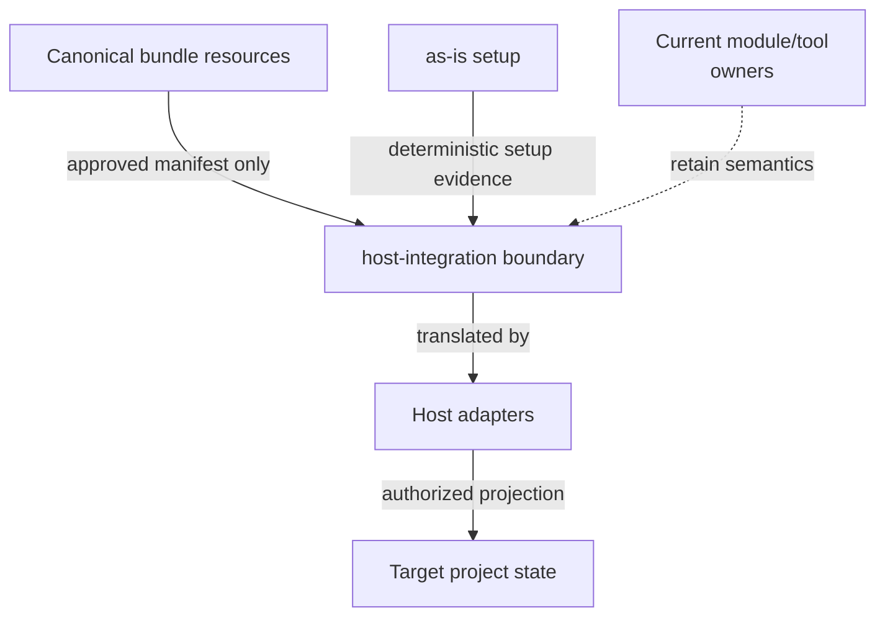

# host-integration - as-is

## Purpose

Provide the durable context for the future installed-host integration boundary without becoming the owner of canonical bundle resources, deterministic module semantics, agent-facing tool authority, or target-project state.

## Design

This component records the approved boundary for future host integration. It does not implement setup, host adapters, target projection, capability discovery, browser management, resource relocation, or runtime behavior.

**Lineage**: [as-is](../as-is.md#design) / **host-integration**

### Installed-host integration boundary

- Root `skills/` and `agents/` remain canonical host-neutral resources. A projected prompt, extension, or host resource is not thereby canonical source or a component.
- `host-integration/` owns future approved installed-host integration context: the resource manifest, supported-host matrix, adapter boundary, target-write allowlist, capability prerequisites, collision/recovery contract, and cross-host validation plan.
- [`core/adapters/host-setup`](../core/adapters/host-setup/as-is.md#design) owns executable client discovery, deterministic inventory, adapter planning, linking, collision handling, idempotence, and its focused tests. Current setup behavior is evidence for this future integration boundary, not a transfer of manifest, projection, or target-write authority.
- Pi, OpenCode, and generic-agent mappings may translate only an explicitly approved manifest. This record does not authorize projection, registration, installation, or host behavior.
- Target projects own persisted host state, existing files, consent, and acceptance of writes. Existing targets must remain protected by future collision and recovery rules.
- Current deterministic modules and agent-facing tools retain their semantics and owners. This record grants no relocation, regrouping, registration, or task/tool authority.
- Browser capability, environment inventory, host discovery, compatibility, and live projection remain separate deferred or unvalidated concerns.
- Prompts, extensions, adapters, and deterministic projection are future resource categories requiring an approved manifest; current paths are not an approved install inventory or write allowlist.
- Future validation must prove manifest conformance, allowed writes only, collision/recovery behavior, fresh-host discovery, and compatibility. Existing setup tests are limited deterministic evidence, not live-host proof.

## Relationships

- `host-integration` uses setup evidence without replacing the setup component's executable boundary.
- Host adapters will translate an approved integration manifest for their host; they will not become canonical resource owners.
- Target projects retain authority over persisted host state and target-side consent.

## Links

- [`../core/adapters/host-setup/as-is.md#design`](../core/adapters/host-setup/as-is.md#design) — deterministic setup adapter boundary and current projection evidence.
- [`../docs/architecture-vocabulary.md#scope-and-authority`](../docs/architecture-vocabulary.md#scope-and-authority) — shared authority and evidence terms.
- [`../docs/opencode-adapter.md`](../docs/opencode-adapter.md) — host-specific OpenCode mapping evidence, not general ownership authority.
