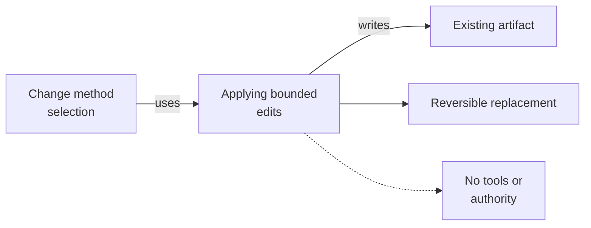

# Applying Bounded Edits - as-is

## Purpose
Make surgical, reversible changes to existing artifacts without expanding into new implementation.

## Design

The skill inspects consumers and surrounding conventions, makes the smallest reversible replacement, and preserves unrelated content and authority. It is a sibling atomic capability under the Skills catalog, deliberately separate from `writing-code`, which covers new or substantially generated implementation; a composition may select between the two after change classification. The skill establishes fit only and grants no tools or authority; it neither delegates work nor changes parent-level records, and it stops when the target, owner, or transformation is ambiguous.

**Lineage**: [as-is](../../as-is.md#design) / [Skills](../as-is.md#design) / **Applying Bounded Edits**

### Bounded edit flow

## Links
- [SKILL.md](SKILL.md) — authoritative procedure and contract.
- [../as-is.md](../../as-is.md) — concise capability catalog entry.