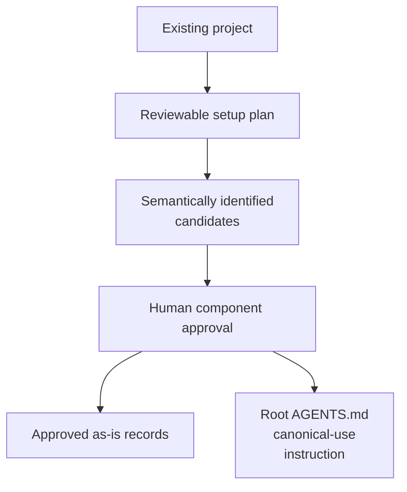

# As-Is Setup - as-is

## Purpose

Initialize the `as-is` documentation convention in an existing project,
including a reviewable component proposal, root instruction integration, and
creation of approved canonical component records.

## Design

The setup skill separates project adoption from individual record maintenance:

**Lineage**: [as-is](../../as-is.md#design) / [Skills](../as-is.md#design) / **As-Is Setup**

### Setup adoption progression

The setup record is a process view, not a parent container view. It uses a
vertical layout because the arrows represent progression from discovery through
approval to durable setup outcomes. The reusable procedure requires a working layout plan only for a critical or host-constrained planned target diagram, so render-surface constraints, shape, density, grouping, routing, and exceptions are decided before a fence is written. Supplementary diagrams use the smallest supported source-level check, and renderer metadata does not enter the canonical record. Setup selects whole-project mode by default
and treats an explicit directory as an independent bounded target; the selected
mode, target, effective boundary, and excluded paths are preserved in the
reviewable plan before any write.

The setup procedure preserves existing content, uses the strict
`# <component-name> - as-is` record title, and delegates record-specific
structure and diagram meaning to `managing-as-is-document`.

## Links

- [`SKILL.md`](SKILL.md) — setup procedure and safety checks.
- [`../managing-as-is-document/as-is.md#design`](../managing-as-is-document/as-is.md#design) — individual record lifecycle.
- [`../../core/contracts/architecture-vocabulary.md#component-boundary`](../../core/contracts/architecture-vocabulary.md#component-boundary) — current-system meaning of component boundaries and canonical records.
- [`../../core/adapters/host-setup/as-is.md#design`](../../core/adapters/host-setup/as-is.md#design) — concrete host-setup adapter implementation evidence.
