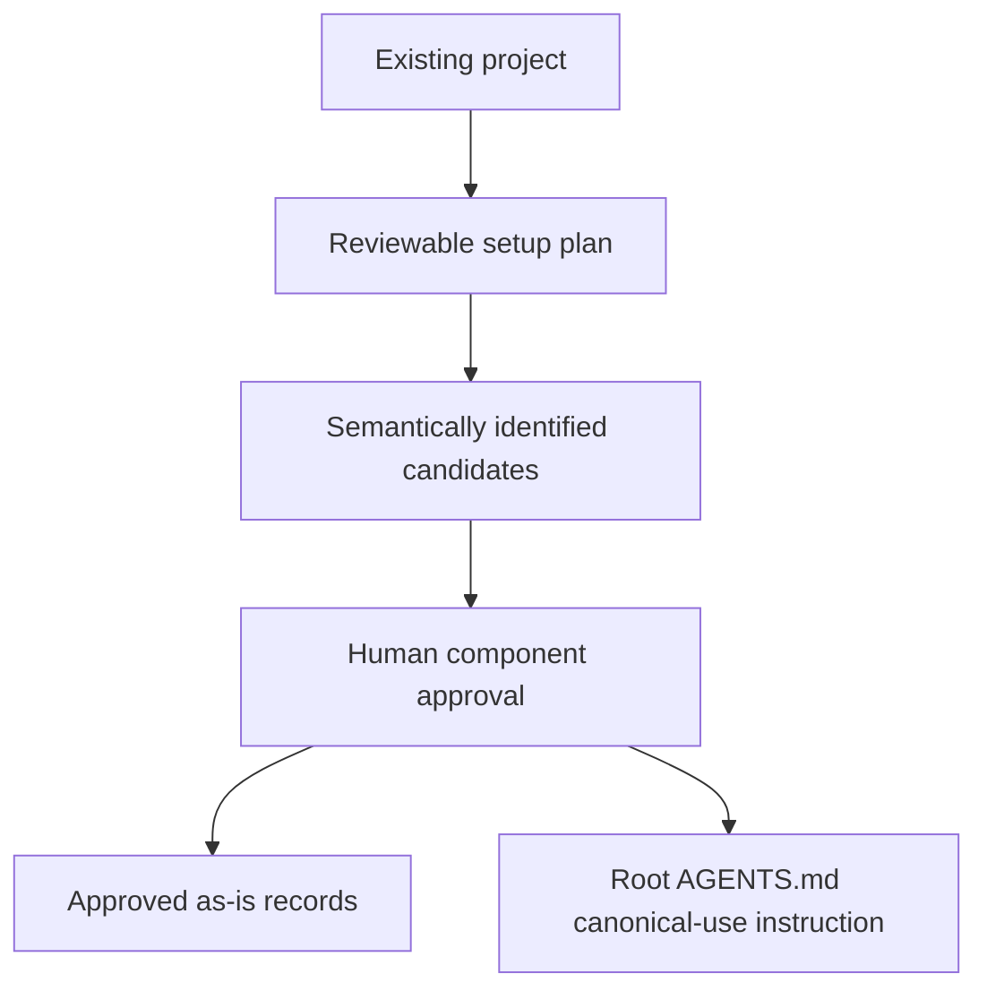

# As-Is Setup - as-is

## Purpose

Initialize the `as-is` documentation convention in an existing project,
including a reviewable component proposal, root instruction integration, and
creation of approved canonical component records.

## Design

The setup skill separates project adoption from individual record maintenance:

The setup record is a process view, not a parent container view. It uses a
vertical layout because the arrows represent progression from discovery through
approval to durable setup outcomes.

Parent: [Skills](../as-is.md#design)

The setup procedure preserves existing content, uses the strict
`# <component-name> - as-is` record title, and delegates record-specific
structure and diagram meaning to `managing-as-is-document`.

## Links

- [`SKILL.md`](SKILL.md) — setup procedure and safety checks.
- [`../managing-as-is-document/as-is.md#design`](../managing-as-is-document/as-is.md#design) — individual record lifecycle.
- [`../../components/as-is-setup/as-is.md#design`](../../components/as-is-setup/as-is.md#design) — implementation evidence for host/client resource wiring.
