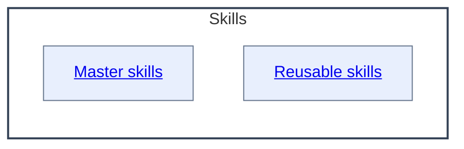

# Skills - as-is

## Purpose
Maintain the durable organization and authority context for reusable skills.
This record is also the concise capability catalog for discovering the skill
components below; each component's `SKILL.md` remains authoritative for its
operational contract.

## Components

| Component | Purpose |
| --- | --- |
| [Master skills](master/as-is.md#design) | Organize adopted master skills that compose authoritative workflows. |
| [Reusable skills](reusable/as-is.md#design) | Organize adopted reusable skills that provide focused capabilities. |

## Design

The Skills component groups the adopted skill definitions in the Master skills and Reusable skills containers; deeper records remain owned by those components. `**Lineage**: ` provides reverse navigation.

**As-is guidance ownership**

| Concern | Canonical owner | Boundary and unresolved work |
| --- | --- | --- |
| Project adoption, setup scope, and approved component identification | [`Managing as-is records`](master/managing-as-is-records/SKILL.md) (adopted; absorbed disposition) and [`core/adapters/host-setup`](../core/adapters/host-setup/as-is.md) | The standalone setup skills are retired with the capability absorbed: durable record creation is carried by the adopted records skill (which grants no tools or authority and does not perform host setup), executable existing-project host wiring remains with the host-setup adapter, and approved component identification remains root-owned backlog work.
| Durable as-is record shape, component meaning, hierarchy, navigation, and as-is-specific diagram meaning | [`Managing as-is records`](master/managing-as-is-records/SKILL.md) (adopted) | The adopted records skill owns record-specific structure and meaning; it does not select components or own generic Mermaid mechanics. (Baseline `managing-as-is-document` retired at F5; runtime-only home retains its validators.) |
| Generic Mermaid representation, view selection, functional framing, labels, readability, and render checks | [`Designing Mermaid diagrams`](master/designing-mermaid-diagrams/SKILL.md) | The generic skill is target-neutral; host-specific record and navigation rules remain with the adopted records skill. (Baseline retired at F5; renderer runtime remains at `skills/designing-mermaid-diagrams/`.) |
| General repository instruction and durable-document disposition | Root [`AGENTS.md`](../AGENTS.md) and root backlog/design tasks | The temporary `As-Is Guidance` section and the root `dissolve-documents-into-as-is-records` review remain unresolved root-owned work; this map does not retire or relocate them. |

The table is an ownership map, not a second procedure or task authority. The linked skill contracts remain authoritative.

The [`building-components-consolidation.md`](building-components-consolidation.md) assessment records the current comparison and recommendation for keeping component maintenance, task lifecycle, and builder composition separate; it is planning evidence, not another operational skill.

| Concept | Meaning |
| --- | --- |
| Capability domain | Groups related competence for navigation. |
| Atomic skill | Has one primary purpose and can be independently invoked, assessed, improved, permissioned, and reused. |
| Operational skill | Applies one or more capabilities to a recurring bounded procedure. |
| Agent role | Combines shared skills with tools, permissions, model settings, and bounded responsibility; agents do not own skill definitions. |
| Workflow or orchestrator | Composes agents and skills, preserves state, applies policy, and coordinates human input. |

Prefer canonical atomic skills over tool-specific procedures or duplicated role instructions. Use the smallest reusable skill with enough independent value to assign, test, improve, observe, or govern. Keep domain playbooks extensible and preserve authority in the owning agent, workflow, or task record.

| Concern | Rule |
| --- | --- |
| Skill composition | Skills remain focused, reusable procedures composed by agents or workflows. |
| Flow ownership | Reusable flow logic belongs in skills rather than duplicated role prompts. |
| Handoff contracts | A skill may describe a handoff or subagent contract, but agent or orchestrator authority remains separate. |
| Repository preference | Prefer repository-local skills for setup, naming, and knowledge organization. |
| External skills | Use installed or external skills only when their assumptions, tools, and output contracts fit. |

**Lineage**: [as-is](../as-is.md#design) / **Skills**

### Skills relationship map

All live skill definitions are cataloged in the two adopted containers; the baseline container retired when its last baseline child retired at F7.
## Links

- [../design-principles.md](../design-principles.md) — repository-wide authority and design principles.
