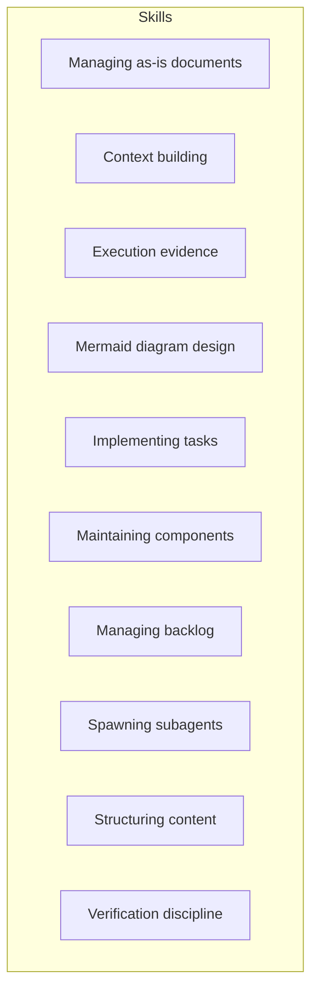

# Skills

## Purpose
Maintain the durable organization and authority context for reusable skills.

## Components

| Component | Purpose |
| --- | --- |
| [Managing as-is documents](managing-as-is-document/as-is.md#design) | Create and maintain durable component records. |
| [Context building](context-building/as-is.md#design) | Assemble bounded, provenance-bearing context. |
| [Execution evidence](exploring-execution-evidence/as-is.md#design) | Investigate traces and readable sessions. |
| [Mermaid diagram design](mermaid-diagram-design/as-is.md#design) | Design bounded Mermaid diagrams for complete component context. |
| [Implementing tasks](implementing-component-tasks/as-is.md#design) | Run bounded component-task lifecycle. |
| [Maintaining components](maintaining-components/as-is.md#design) | Perform evidence-based component housekeeping. |
| [Managing backlog](managing-backlog/as-is.md#design) | Prioritize bounded work proposals. |
| [Spawning subagents](spawning-pi-subagents/as-is.md#design) | Launch and observe bounded Pi subprocesses. |
| [Structuring content](structuring-content/as-is.md#design) | Organize repository knowledge. |
| [Verification discipline](verification-discipline/as-is.md#design) | Select acceptance evidence by risk. |

## Design

The skills area groups its immediate documented skill components; deeper skill
records are owned and described by those components.

If the host Markdown renderer suppresses Mermaid navigation, use the component
names in the table above; those Markdown links are authoritative.

## Links

- [../agent-skills.md](../agent-skills.md) — concise capability catalog.
