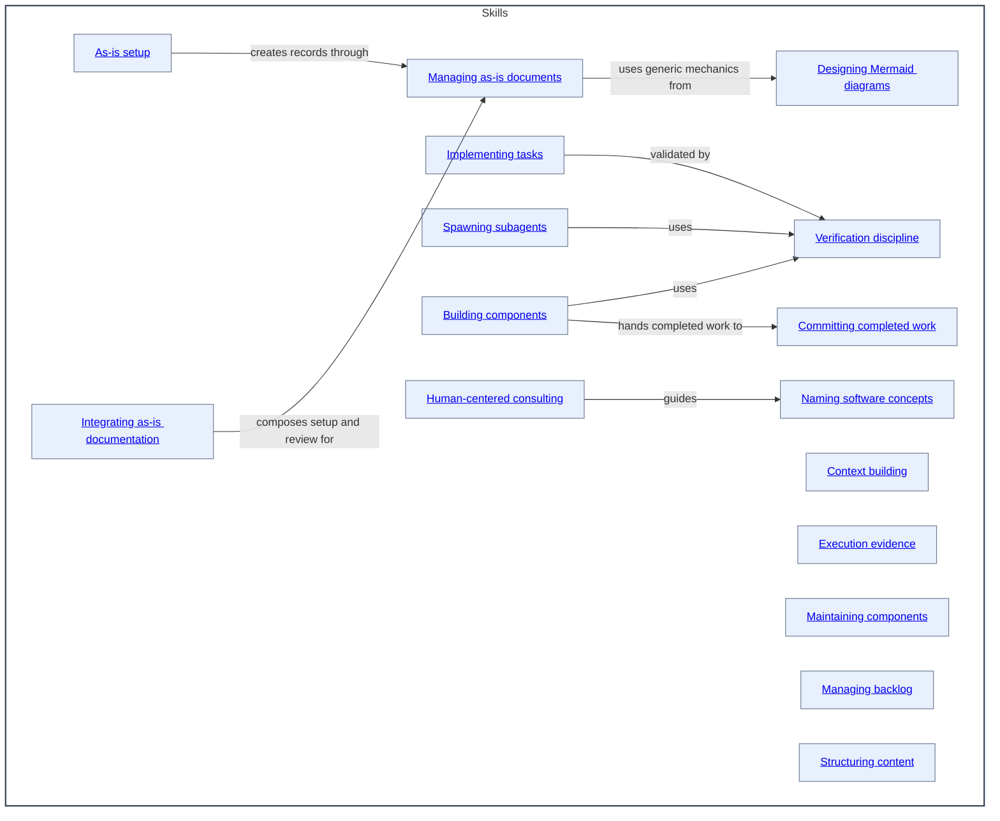

# Skills - as-is

## Purpose
Maintain the durable organization and authority context for reusable skills.
This record is also the concise capability catalog for discovering the skill
components below; each component's `SKILL.md` remains authoritative for its
operational contract.

## Capability model

- A **capability domain** groups related competence for navigation.
- An **atomic skill** has one primary purpose and can be independently invoked,
  assessed, improved, permissioned, and reused.
- An **operational skill** applies one or more capabilities to a recurring
  bounded procedure.
- An **agent role** combines shared skills with tools, permissions, model
  settings, and a bounded responsibility; agents do not own skill definitions.
- A **workflow or orchestrator** composes agents and skills, preserves state,
  applies policy, and coordinates human input.

Prefer canonical atomic skills over tool-specific procedures or duplicated role
instructions. Use the smallest reusable skill that has enough independent value
to assign, test, improve, observe, or govern. Keep domain-specific playbooks
extensible and preserve authority in the owning agent, workflow, or task record.

## Components

| Component | Purpose |
| --- | --- |
| [As-is setup](as-is-setup/as-is.md#design) | Introduce canonical as-is documentation into an existing project. |
| [Integrating as-is documentation](integrate-as-is-documentation/as-is.md#design) | Review and create as-is records in an existing project. |
| [Managing as-is documents](managing-as-is-document/as-is.md#design) | Create and maintain durable component records. |
| [Context building](context-building/as-is.md#design) | Assemble bounded, provenance-bearing context. |
| [Execution evidence](exploring-execution-evidence/as-is.md#design) | Investigate traces and readable sessions. |
| [Designing Mermaid diagrams](designing-mermaid-diagrams/as-is.md#design) | Design bounded Mermaid diagrams for complete component context. |
| [Naming software concepts](naming-software-concepts/as-is.md#design) | Choose semantically accurate names for repository concepts. |
| [Implementing tasks](implementing-component-tasks/as-is.md#design) | Run bounded component-task lifecycle. |
| [Maintaining components](maintaining-components/as-is.md#design) | Perform evidence-based component housekeeping. |
| [Managing backlog](managing-backlog/as-is.md#design) | Prioritize bounded work proposals. |
| [Spawning subagents](spawning-pi-subagents/as-is.md#design) | Launch and observe bounded Pi subprocesses. |
| [Structuring content](structuring-content/as-is.md#design) | Organize repository knowledge. |
| [Verification discipline](verification-discipline/as-is.md#design) | Select acceptance evidence by risk. |
| [Building components](building-components/as-is.md#design) | Build bounded components and produce durable handoffs. |
| [Committing completed work](committing-completed-work/as-is.md#design) | Create scoped commits for validated completed work. |
| [Human-centered consulting](human-centered-consulting/as-is.md#design) | Guide concise, agency-preserving consultation. |

## Design

The Skills component groups its immediate documented skill components; deeper skill records are owned and described by those components. The container diagram uses the actual Skills component name and linked child boxes. Reverse navigation to the parent is kept as a nearby Markdown link. Skills remain focused, reusable procedures and may be composed by an agent or workflow. Reusable flow logic belongs in skills rather than duplicated role prompts. A skill may describe a handoff or subagent contract as an input or output, but authority to select, launch, observe, recover, or cancel a subagent remains with the agent or orchestrator. Repository-local skills are preferred for setup, naming, and knowledge organization; external or installed skills fit only when their assumptions, tools, and output contracts match this repository.

[as-is](../as-is.md#design) / **Skills**

- Pre-render layout plan: the Markdown render surface has no fixed dimensions; keep this as a balanced relationship map with 16 child boxes and eight labeled arrows, using LR grouping and routing; renderer-specific layout remains untested residual risk.

### Skills relationship map

If the host Markdown renderer suppresses Mermaid navigation, use the component
names in the table above; those Markdown links remain authoritative.

## Links

- [../agent-skills.md](../agent-skills.md) — migration-era conceptual catalog retained as a linked reference.
- [../docs/design-principles.md](../docs/design-principles.md) — repository-wide authority and design principles.
