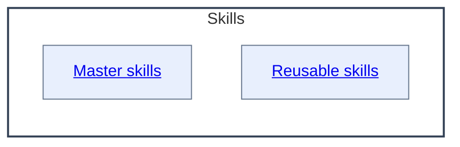

# Skills - as-is

## Purpose
Maintain the durable organization, authority context, and authoritative classification catalog for reusable skills. The `master/` and `reusable/` directories are physical storage groupings from the adoption sequence, not semantic capability classes: they encode mount provenance rather than a capability taxonomy.

## Components

| Component | Purpose |
| --- | --- |
| [Master skills](master/as-is.md#design) | Document the physical storage grouping containing twelve adopted skill components. |
| [Reusable skills](reusable/as-is.md#design) | Document the physical storage grouping containing twenty-three adopted skill components. |

## Design

**Lineage**: [as-is](../as-is.md#design) / **Skills**

The Skills component provides the concise capability catalog and the authoritative classification of all thirty-five skill components. Classification is an attribute in the catalog table below; membership in `master/` or `reusable/` does not determine classification. The two child records preserve the physical tree and explicitly do not claim semantic capability boundaries.

### Capability classification

| Skill | Physical path | Classification |
| --- | --- | --- |
| Building components | `master/building-components` | `composition-authority` |
| Committing completed work | `master/committing-completed-work` | `composition-authority` |
| Consulting humans | `master/consulting-humans` | `composable-procedure` |
| Designing Mermaid diagrams | `master/designing-mermaid-diagrams` | `composable-procedure` |
| Exploring execution evidence | `master/exploring-execution-evidence` | `composable-procedure` |
| Implementing tasks | `master/implementing-tasks` | `composition-authority` |
| Maintaining components | `master/maintaining-components` | `composition-authority` |
| Making changes | `master/making-changes` | `composition-authority` |
| Managing as-is records | `master/managing-as-is-records` | `composition-authority` |
| Managing backlogs | `master/managing-backlogs` | `composition-authority` |
| Managing changelogs | `master/managing-changelogs` | `composable-procedure` |
| Spawning subagents | `master/spawning-subagents` | `composition-authority` |
| Applying bounded edits | `reusable/applying-bounded-edits` | `composable-procedure` |
| Assessing determinism | `reusable/assessing-determinism` | `composable-procedure` |
| Building context | `reusable/building-context` | `composable-procedure` |
| Choosing change methods | `reusable/choosing-change-methods` | `composable-procedure` |
| Choosing names | `reusable/choosing-names` | `composable-procedure` |
| Delegating bounded work | `reusable/delegating-bounded-work` | `composable-procedure` |
| Designing diagrams | `reusable/designing-diagrams` | `composable-procedure` |
| Drafting changelog entries | `reusable/drafting-changelog-entries` | `composable-procedure` |
| Drafting content | `reusable/drafting-content` | `composable-procedure` |
| Identifying owners | `reusable/identifying-owners` | `composable-procedure` |
| Inspecting execution evidence | `reusable/inspecting-execution-evidence` | `composable-procedure` |
| Locating changelogs | `reusable/locating-changelogs` | `composable-procedure` |
| Observing delegated work | `reusable/observing-delegated-work` | `composable-procedure` |
| Preparing scoped commits | `reusable/preparing-scoped-commits` | `composable-procedure` |
| Presenting decisions | `reusable/presenting-decisions` | `composable-procedure` |
| Recording backlog items | `reusable/recording-backlog-items` | `composable-procedure` |
| Recording evidence | `reusable/recording-evidence` | `composable-procedure` |
| Resolving scopes | `reusable/resolving-scopes` | `composable-procedure` |
| Running tests | `reusable/running-tests` | `composable-procedure` |
| Structuring content | `reusable/structuring-content` | `composable-procedure` |
| Validating changes | `reusable/validating-changes` | `composable-procedure` |
| Writing code | `reusable/writing-code` | `composable-procedure` |
| Writing tests | `reusable/writing-tests` | `composable-procedure` |

`composition-authority` identifies a skill that composes authoritative workflow steps and bounded component outcomes. `composable-procedure` identifies a focused capability that can be invoked independently. The classes intentionally overlap the physical storage split: consulting, diagram design, evidence exploration, changelog maintenance, and other master-mounted skills remain composable procedures when their own purposes are focused, while reusable-mounted skills remain procedures by design.

### Runtime support

The following runtime homes are cross-references to capabilities executed outside the Skills component; they are not Skills children and do not change the catalog's thirty-five-skill count.

| Runtime home | Actual record | Skill capability executed |
| --- | --- | --- |
| `core/adapters/pi` | [Pi adapter](../core/adapters/pi/as-is.md) | [Spawning subagents](master/spawning-subagents/SKILL.md) — governed delegation launcher and worker registration. |
| `tools/as-is-validators` | [As-is validators](../tools/as-is-validators/as-is.md) | [Managing as-is records](master/managing-as-is-records/SKILL.md) — repository-wide record and navigation validation. |
| `tools/backlog-query` | [Backlog query](../tools/backlog-query/as-is.md) | [Managing backlogs](master/managing-backlogs/SKILL.md) — backlog schema walk and query operations. |
| `tools/mermaid-renderer` | [Mermaid renderer](../tools/mermaid-renderer/as-is.md) | [Designing Mermaid diagrams](master/designing-mermaid-diagrams/SKILL.md) — rendered navigation checks and service support. |

The physical namespace also retains these directly owned artifacts: `AGENTS.md`, `as-is.md`, `backlog.md`, `changelog.md`, and `building-components-consolidation.md`. The last is planning evidence for the composition-authority skills, remains in `skills/`, and is already cited by this catalog; it is not an operational skill or a component record.

**As-is guidance ownership**

| Concern | Canonical owner | Boundary and unresolved work |
| --- | --- | --- |
| Project adoption, setup scope, and approved component identification | [`Managing as-is records`](master/managing-as-is-records/SKILL.md) (adopted; absorbed disposition) and [`core/adapters/host-setup`](../core/adapters/host-setup/as-is.md) | The standalone setup skills are retired with the capability absorbed: durable record creation is carried by the adopted records skill (which grants no tools or authority and does not perform host setup), executable existing-project host wiring remains with the host-setup adapter, and approved component identification remains root-owned backlog work. |
| Durable as-is record shape, component meaning, hierarchy, navigation, and as-is-specific diagram meaning | [`Managing as-is records`](master/managing-as-is-records/SKILL.md) (adopted) | The adopted records skill owns record-specific structure and meaning; it does not select components or own generic Mermaid mechanics. (Baseline `managing-as-is-document` retired at F5; runtime-only home retains its validators at `tools/as-is-validators/`.) |
| Generic Mermaid representation, view selection, functional framing, labels, readability, and render checks | [`Designing Mermaid diagrams`](master/designing-mermaid-diagrams/SKILL.md) | The generic skill is target-neutral; host-specific record and navigation rules remain with the adopted records skill. (Baseline retired at F5; renderer runtime is retained at `tools/mermaid-renderer/`.) |
| General repository instruction and durable-document disposition | Root [`AGENTS.md`](../AGENTS.md) and root backlog/design tasks | The temporary `As-Is Guidance` section and the root `dissolve-documents-into-as-is-records` review remain unresolved root-owned work; this map does not retire or relocate them. |

The table is an ownership map, not a second procedure or task authority. The linked skill contracts remain authoritative.

The [`building-components-consolidation.md`](building-components-consolidation.md) assessment records the current comparison and recommendation for keeping component maintenance, task lifecycle, and builder composition separate; it is planning evidence, not another operational skill.

| Concept | Meaning |
| --- | --- |
| Capability domain | Groups related competence for navigation. |
| Atomic skill | Has one primary purpose and can be independently invoked, assessed, improved, permissioned, and reused. |
| Operational skill | Applies one or more capabilities to a recurring bounded procedure. |
| Agent role | Combines shared skills with tools, permissions, model settings, and bounded responsibility; agents do not own skill definitions. |
| Workflow or orchestrator | Composes agents and skills, preserves state, applies policy, and coordinates human input. |

Prefer canonical atomic skills over tool-specific procedures or duplicated role instructions. Use the smallest reusable skill with enough independent value to assign, test, improve, observe, or govern. Keep domain playbooks extensible and preserve authority in the owning agent, workflow, or task record.

| Concern | Rule |
| --- | --- |
| Skill composition | Skills remain focused, reusable procedures composed by agents or workflows. |
| Flow ownership | Reusable flow logic belongs in skills rather than duplicated role prompts. |
| Handoff contracts | A skill may describe a handoff or subagent contract, but agent or orchestrator authority remains separate. |
| Repository preference | Prefer repository-local skills for setup, naming, and knowledge organization. |
| External skills | Use installed or external skills only when their assumptions, tools, and output contracts fit. |

### Skills relationship map

All live skill definitions are cataloged in the two adopted storage-group records; the baseline container retired when its last baseline child retired at F7.

## Links

- [../design-principles.md](../design-principles.md) — repository-wide authority and design principles.
