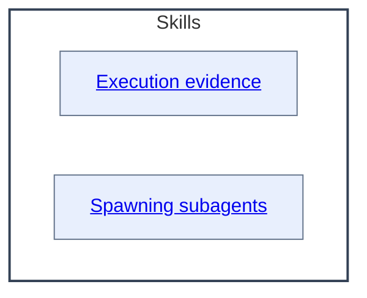

# Skills - as-is

## Purpose
Maintain the durable organization and authority context for reusable skills.
This record is also the concise capability catalog for discovering the skill
components below; each component's `SKILL.md` remains authoritative for its
operational contract.

## Components

| Component | Purpose |
| --- | --- |
| [Execution evidence](exploring-execution-evidence/as-is.md#design) | Investigate traces and readable sessions. |
| [Spawning subagents](spawning-pi-subagents/as-is.md#design) | Launch and observe bounded Pi subprocesses. |

## Design

The Skills component groups immediate documented skill components; deeper records remain owned by those components. The container diagram uses the actual Skills name and linked child boxes. `**Lineage**: ` provides reverse navigation, while the Components table provides renderer-independent child navigation.

**As-is guidance ownership**

| Concern | Canonical owner | Boundary and unresolved work |
| --- | --- | --- |
| Project adoption, setup scope, and approved component identification | [`Managing as-is records`](master/managing-as-is-records/SKILL.md) (adopted; absorbed disposition) and [`core/adapters/host-setup`](../core/adapters/host-setup/as-is.md) | The standalone setup skills are retired with the capability absorbed: durable record creation is carried by the adopted records skill (which grants no tools or authority and does not perform host setup), executable existing-project host wiring remains with the host-setup adapter, and approved component identification remains root-owned backlog work.
| Durable as-is record shape, component meaning, hierarchy, navigation, and as-is-specific diagram meaning | [`Managing as-is documents`](managing-as-is-document/SKILL.md) | This skill owns record-specific structure and meaning; it does not select components or own generic Mermaid mechanics. |
| Generic Mermaid representation, view selection, functional framing, labels, readability, and render checks | [`Designing Mermaid diagrams`](designing-mermaid-diagrams/SKILL.md) | The generic skill is target-neutral; host-specific record and navigation rules remain with `managing-as-is-document`. |
| General repository instruction and durable-document disposition | Root [`AGENTS.md`](../AGENTS.md) and root backlog/design tasks | The temporary `As-Is Guidance` section and the root `dissolve-documents-into-as-is-records` review remain unresolved root-owned work; this map does not retire or relocate them. |

The table is an ownership map, not a second procedure or task authority. The linked skill contracts remain authoritative.

The [`building-components-consolidation.md`](building-components-consolidation.md) assessment records the current comparison and recommendation for keeping component maintenance, task lifecycle, and builder composition separate; it is planning evidence, not another operational skill.

| Concept | Meaning |
| --- | --- |
| Capability domain | Groups related competence for navigation. |
| Atomic skill | Has one primary purpose and can be independently invoked, assessed, improved, permissioned, and reused. |
| Operational skill | Applies one or more capabilities to a recurring bounded procedure. |
| Agent role | Combines shared skills with tools, permissions, model settings, and bounded responsibility; agents do not own skill definitions. |
| Workflow or orchestrator | Composes agents and skills, preserves state, applies policy, and coordinates human input. |

Prefer canonical atomic skills over tool-specific procedures or duplicated role instructions. Use the smallest reusable skill with enough independent value to assign, test, improve, observe, or govern. Keep domain playbooks extensible and preserve authority in the owning agent, workflow, or task record.

| Concern | Rule |
| --- | --- |
| Skill composition | Skills remain focused, reusable procedures composed by agents or workflows. |
| Flow ownership | Reusable flow logic belongs in skills rather than duplicated role prompts. |
| Handoff contracts | A skill may describe a handoff or subagent contract, but agent or orchestrator authority remains separate. |
| Repository preference | Prefer repository-local skills for setup, naming, and knowledge organization. |
| External skills | Use installed or external skills only when their assumptions, tools, and output contracts fit. |

**Lineage**: [as-is](../as-is.md#design) / **Skills**

### Skills relationship map

If the host Markdown renderer suppresses Mermaid navigation, use the component
names in the table above; those Markdown links remain authoritative.
## Links

- [../design-principles.md](../design-principles.md) — repository-wide authority and design principles.

## Adopted composable catalog (side-by-side, transitional)

The composable-skills composition is advanced (ACCEPTED-TARGET,
`candidate/advancement-record.md`) and lands side-by-side per the approved
adoption plan. Each entry's `as-is.md` is approved design; its `SKILL.md`
remains the operational contract. This section is transitional: baseline
entries above retire family-by-family, and this catalog reduces to the
adopted set at F9.

### Master skills (skills/master/)

| Component | Purpose |
| --- | --- |
| [Building components](master/building-components/as-is.md#design) | Build bounded components and produce durable handoffs. |
| [Committing completed work](master/committing-completed-work/as-is.md#design) | Create scoped commits for validated completed work. |
| [Consulting humans](master/consulting-humans/as-is.md#design) | Guide concise, agency-preserving consultation. |
| [Designing Mermaid diagrams](master/designing-mermaid-diagrams/as-is.md#design) | Design bounded Mermaid diagrams for complete component context. |
| [Exploring execution evidence](master/exploring-execution-evidence/as-is.md#design) | Investigate traces and readable sessions. |
| [Implementing tasks](master/implementing-tasks/as-is.md#design) | Run bounded component-task lifecycle. |
| [Maintaining components](master/maintaining-components/as-is.md#design) | Perform evidence-based component housekeeping. |
| [Making changes](master/making-changes/as-is.md#design) | Apply bounded, validated changes to components. |
| [Managing as-is records](master/managing-as-is-records/as-is.md#design) | Create and maintain durable component records. |
| [Managing backlogs](master/managing-backlogs/as-is.md#design) | Prioritize bounded work proposals. |
| [Managing changelogs](master/managing-changelogs/as-is.md#design) | Maintain component changelogs. |
| [Spawning subagents](master/spawning-subagents/as-is.md#design) | Launch and observe bounded Pi subprocesses. |

### Reusable skills (skills/reusable/)

| Component | Purpose |
| --- | --- |
| [Applying bounded edits](reusable/applying-bounded-edits/as-is.md#design) | Make small, precise edits within a bounded scope. |
| [Assessing determinism](reusable/assessing-determinism/as-is.md#design) | Identify evidence-supported deterministic improvements. |
| [Building context](reusable/building-context/as-is.md#design) | Assemble bounded, provenance-bearing context. |
| [Choosing change methods](reusable/choosing-change-methods/as-is.md#design) | Select the smallest change method that satisfies the need. |
| [Choosing names](reusable/choosing-names/as-is.md#design) | Choose semantically accurate names for repository concepts. |
| [Delegating bounded work](reusable/delegating-bounded-work/as-is.md#design) | Delegate bounded tasks under existing authority. |
| [Designing diagrams](reusable/designing-diagrams/as-is.md#design) | Design bounded diagrams for component context. |
| [Drafting changelog entries](reusable/drafting-changelog-entries/as-is.md#design) | Draft concise changelog entries. |
| [Drafting content](reusable/drafting-content/as-is.md#design) | Draft durable repository content. |
| [Identifying owners](reusable/identifying-owners/as-is.md#design) | Identify owning components and authorities. |
| [Inspecting execution evidence](reusable/inspecting-execution-evidence/as-is.md#design) | Investigate traces and readable sessions read-only. |
| [Locating changelogs](reusable/locating-changelogs/as-is.md#design) | Locate the owning changelog for a change. |
| [Observing delegated work](reusable/observing-delegated-work/as-is.md#design) | Observe delegated work without granting execution authority. |
| [Preparing scoped commits](reusable/preparing-scoped-commits/as-is.md#design) | Prepare scoped Git commits for validated work. |
| [Presenting decisions](reusable/presenting-decisions/as-is.md#design) | Present decisions with alternatives and material effects. |
| [Recording backlog items](reusable/recording-backlog-items/as-is.md#design) | Record bounded work proposals in backlog records. |
| [Recording evidence](reusable/recording-evidence/as-is.md#design) | Record completion and validation evidence. |
| [Resolving scopes](reusable/resolving-scopes/as-is.md#design) | Resolve component scopes and boundaries for work. |
| [Running tests](reusable/running-tests/as-is.md#design) | Run the smallest relevant test automation. |
| [Structuring content](reusable/structuring-content/as-is.md#design) | Organize repository knowledge. |
| [Validating changes](reusable/validating-changes/as-is.md#design) | Validate changed behavior against acceptance conditions. |
| [Writing code](reusable/writing-code/as-is.md#design) | Create or substantially implement code from bounded requirements. |
| [Writing tests](reusable/writing-tests/as-is.md#design) | Write focused tests for bounded behavior. |
