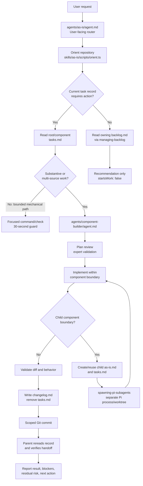
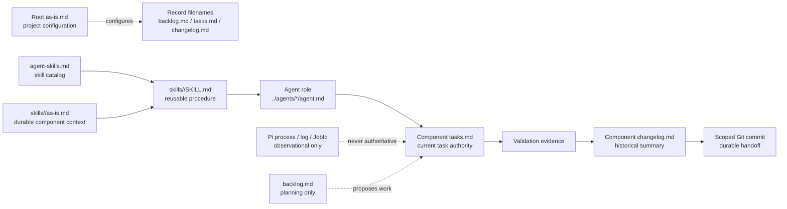
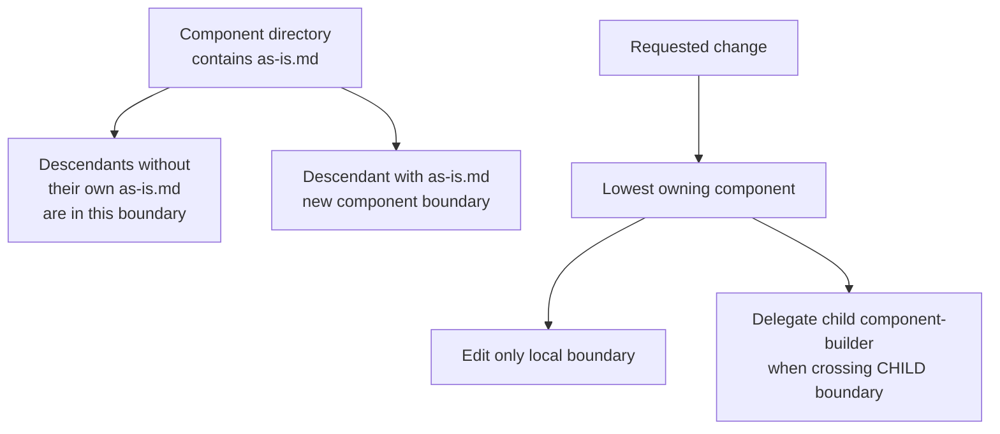

# Skills

## Purpose
Maintain the durable organization and authority context for reusable skills.

## Design

### Request and execution flow

### Authority and artifact flow

### Component boundary rule

**Key:** solid arrows are control/data flow; dotted arrows are configuration,
planning, or observation only. Skills provide procedures, agents hold
authority, durable task records hold current state, and runtime artifacts never
replace them.

## Requirement
Skill procedures live in `skills/<name>/SKILL.md`; their component records
live beside them. This scope record links the catalog and notable entry points
without duplicating skill contracts. Backlog prioritization is defined by
`managing-backlog`; task implementation and lifecycle are defined by
`implementing-component-tasks`.

## Plan
Add the skills-scope record and make the canonical context-building skill
discoverable.

## Progress
Created this durable record and added the context-building skill component.

## Validation
Root integration should validate task-record structure, links, naming, and
`git diff --check`. No runtime behavior is changed.

## Result
Completed the skills-scope documentation record and authority rule.

## Blockers And Escalations
None. Skill changes require their own bounded component record.

## Recovery
Resume from this record and the named skill component; do not duplicate
procedures in the catalog.

## Links
- `../agent-skills.md` — concise capability catalog.
- `context-building/SKILL.md` — high-priority context-building contract.
- `structuring-content/SKILL.md` — reusable organization procedure.
- `verification-discipline/SKILL.md` — validation selection procedure.
- `managing-backlog/SKILL.md` — backlog capture and prioritization.
- `implementing-component-tasks/SKILL.md` — transient task implementation and lifecycle.
- `backlog.md` — skills-component planning index for reusable skill work.
- `changelog.md` — concise completed handoff history for this component.

## Next Action
Keep catalog entries concise and link detailed procedures from their owning
skill documents.
