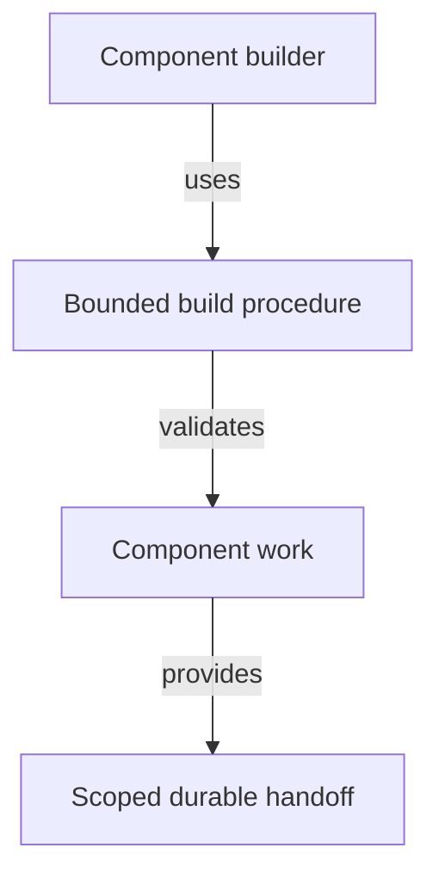

# Building Components - as-is

## Purpose

Provide the reusable procedure for building one bounded component and producing a validated, scoped durable handoff while preserving agent authority and task-record ownership.

## Design

The skill composes task implementation, validation, recovery, and completion procedures. It guides a builder through context, expert review, bounded implementation, child handoff, acceptance evidence, descendant closure, and durable handoff without selecting or launching agents itself.

**Lineage**: [as-is](../../as-is.md#design) / [Skills](../as-is.md#design) / **Building Components**

### Bounded build handoff

The skill is reusable procedure, not authority. The configured agent remains responsible for component selection, delegation, parent integration, completion decisions, and any required approvals.

## Links

- [`SKILL.md`](SKILL.md) — authoritative build procedure.
- [`../../docs/architecture-vocabulary.md#component-boundary`](../../docs/architecture-vocabulary.md#component-boundary) — current-system boundary and ownership definitions used by the build procedure.
- [`../../agents/component-builder/agent.md`](../../agents/component-builder/agent.md) — role that retains build authority.
- [`../implementing-component-tasks/SKILL.md`](../implementing-component-tasks/SKILL.md) — task lifecycle.
- [`../verification-discipline/SKILL.md`](../verification-discipline/SKILL.md) — validation evidence.
