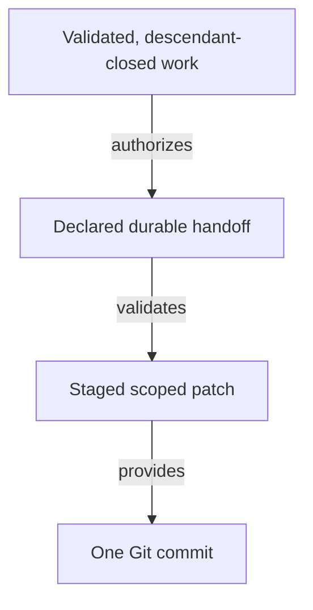

# Committing Completed Work - as-is

## Purpose

Provide the reusable completion procedure for creating one scoped Git handoff from validated, descendant-closed component work without staging unrelated changes.

## Design

The skill checks completion preconditions, stages only declared durable artifacts, validates the staged patch, creates one concise commit, preserves unrelated work, and reconciles the exact selected backlog item after the handoff exists. It does not authorize partial or unvalidated commits.

[as-is](../../as-is.md#design) / [Skills](../as-is.md#design) / **Committing Completed Work**

- Pre-render layout plan: use the repository Markdown render surface without assuming fixed dimensions; arrange four short-labeled nodes and three directed edges as a taller-than-wide TB/ELK-style progression from validated work through scoped staging to one commit. Keep one ungrouped route; renderer geometry remains untested.

### Scoped commit handoff

The completion procedure is downstream of task authority and validation. The owning agent decides semantic completion; the skill supplies mechanical scope and evidence gates.

## Links

- [`SKILL.md`](SKILL.md) — authoritative scoped-commit procedure.
- [`../implementing-component-tasks/SKILL.md`](../implementing-component-tasks/SKILL.md) — task completion preconditions.
- [`../managing-backlog/SKILL.md`](../managing-backlog/SKILL.md) — evidence-gated backlog reconciliation.
