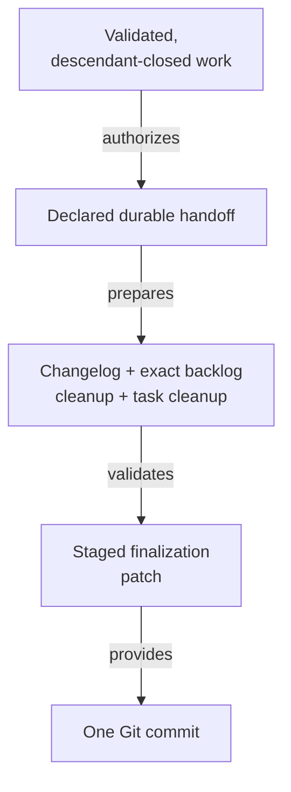

# Committing Completed Work - as-is

## Purpose

Provide the reusable completion procedure for creating one scoped Git handoff from validated, descendant-closed component work without staging unrelated changes.

## Design

The skill checks completion preconditions, stages the declared durable handoff together with the owning changelog summary, exact evidence-gated backlog-row removal, and configured task-artifact cleanup, validates the complete finalization patch, creates one concise commit, and preserves unrelated work. It does not authorize partial or unvalidated commits or separate task-deletion/backlog-clearance commits. The changelog evidence is written before backlog cleanup eligibility is evaluated, and all three cleanup artifacts become durable together at the Git commit boundary.

**Lineage**: [as-is](../../as-is.md#design) / [Skills](../as-is.md#design) / **Committing Completed Work**

### Scoped commit handoff

The completion procedure is downstream of task authority and validation. The owning agent decides semantic completion; the skill supplies mechanical scope and evidence gates.

## Links

- [`SKILL.md`](SKILL.md) — authoritative scoped-commit procedure.
- [`../implementing-component-tasks/SKILL.md`](../implementing-component-tasks/SKILL.md) — task completion preconditions.
- [`../managing-backlog/SKILL.md`](../managing-backlog/SKILL.md) — evidence-gated backlog reconciliation.
