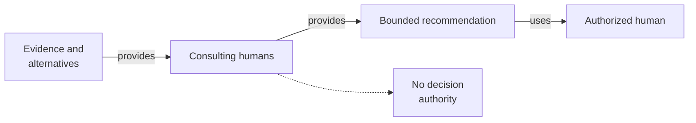

# Consulting humans - as-is

## Purpose
Guide bounded decisions while preserving human agency.

## Design

The skill presents the decision, evidence, alternatives, uncertainty, and recommendation, then stops for the authorized human choice. The realization plan cites no composition table, workflow example, or tool-access row for this master, so it carries only the general composition-admission acknowledgment that admission requires the agent to hold every tool needed for its selected path or the workflow stops with a bounded missing-capability blocker. The skill establishes fit, not permission: it grants no tools or authority and recommends without deciding or executing.

**Lineage**: [as-is](../../as-is.md#design) / [Skills](../as-is.md#design) / **Consulting humans**

### Human consultation flow

## Links
- [SKILL.md](SKILL.md) — authoritative procedure and contract.
- [../as-is.md](../../as-is.md) — concise capability catalog entry.