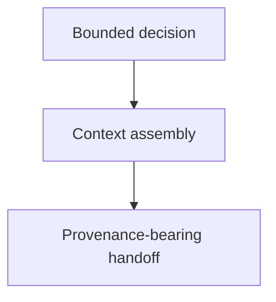

# Context Building - as-is

## Purpose
Provide reusable context assembly for bounded decisions and handoffs.

## Design

The component is organized around the following relationships and flow.

[as-is](../../as-is.md#design) / [Skills](../as-is.md#design) / **Context Building**

### Context assembly flow

Pre-render layout plan: the Markdown render surface has no fixed dimensions; use a compact top-to-bottom (TB/ELK-style) three-stage progression, with three visible nodes and two unlabeled edges, one ungrouped linear route, and direct downward routing. Renderer behavior is untested, so host-specific Mermaid layout and rendering remain residual risk.

## Links
- [SKILL.md](SKILL.md) — authoritative procedure and contract.
- [../../agent-skills.md](../../agent-skills.md) — concise capability catalog entry.
