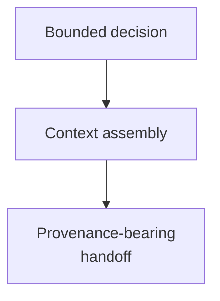

# Context Building - as-is

## Purpose
Provide reusable context assembly for bounded decisions and handoffs.

## Design

The component is organized around the following relationships and flow.

**Lineage**: [as-is](../../as-is.md#design) / [Skills](../as-is.md#design) / **Context Building**

### Context assembly flow

## Links
- [SKILL.md](SKILL.md) — authoritative procedure and contract.
- [../../agent-skills.md](../../agent-skills.md) — concise capability catalog entry.
