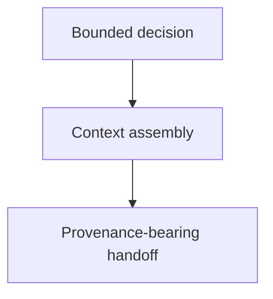

# Context Building

## Purpose
Provide reusable context assembly for bounded decisions and handoffs.

## Diagram

## Links
- `SKILL.md` — authoritative procedure and contract.
- `backlog.md` — planning index for this skill's open work.
- `../../agent-skills.md` — concise capability catalog entry.
