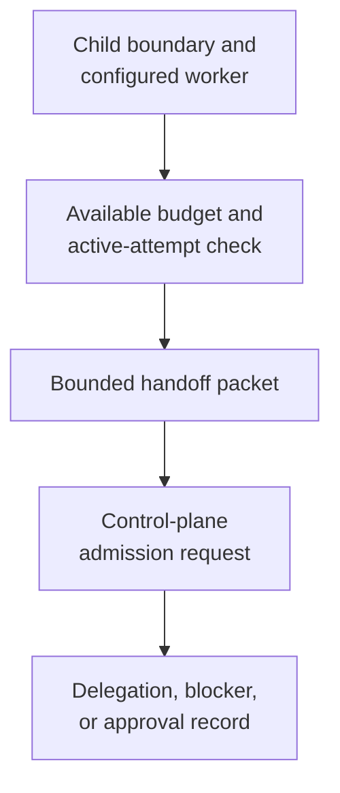

# Delegating Bounded Work - as-is

## Purpose

Prepare a bounded child handoff without transferring authority implicitly while the parent retains task, budget, status, and ownership authority.

## Design

The skill distinguishes in-process `call_subagent` assistance within the same component from a separately owned child, verifies the child's boundary, configured worker, task revision, and active-attempt state, and calculates a handoff that fits available cost and wall-clock budget after local use and retained reserve. It grants no tools or authority and does not launch the child.

**Lineage**: [as-is](../../as-is.md#design) / [Skills](../as-is.md#design) / **Delegating Bounded Work**

### Bounded handoff flow

| Concern | Rule |
| --- | --- |
| Boundary | Use in-process `call_subagent` for same-component assistance, distinguish it from a separately owned child, and never delegate parent authority or sibling files. |
| Admission | Verify component boundary, configured worker, task revision, and absence of an active attempt before requesting control-plane admission. |
| Budget | Calculate allocation minus local spent use and retained reserve, then fit this handoff with existing child allocations. |
| Handoff | Record outcome, scope, linked context, acceptance, changed-artifact boundary, recovery checkpoint, return format, and handoff budget. |
| Recording | Record the delegation, blocker, or required approval durably; this skill does not launch or authorize work. |
| Authority | The parent retains task, budget, status, and ownership authority; the skill grants no tools or authority. |

## Links

- [SKILL.md](SKILL.md) — authoritative bounded handoff procedure.
- [../as-is.md](../../as-is.md#design) — concise capability catalog entry.
- [../../agents/component-builder/as-is.md#design](../../agents/component-builder/as-is.md#design) — role ownership and boundary.
