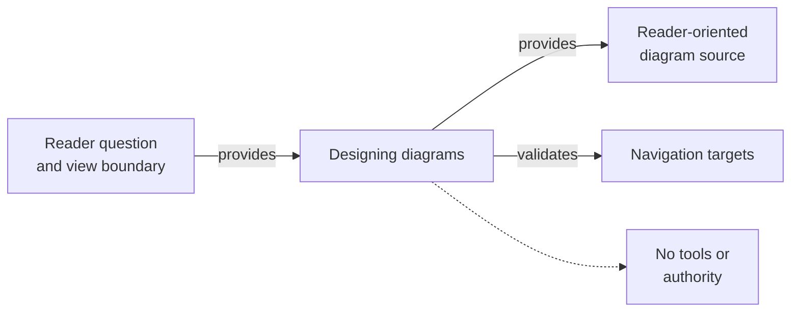

# Designing Diagrams - as-is

## Purpose
Design bounded, reader-oriented visual explanations for a defined question and view boundary.

## Design

The skill defines the reader question and view boundary, chooses functional nodes and canonical relationships, and designs labels and layout for scanning while keeping source, navigation, and ownership accurate. It is a design sibling under the Skills catalog, related to the cataloged Mermaid design capability: this skill stays target-neutral on view selection and leaves host-specific record and navigation rules to the owning records. The skill establishes fit for designing and render-validating diagrams only and grants no tools or authority; it includes only supported context and provides source and expected navigation targets for validation without altering the rendered artifact's owner.

**Lineage**: [as-is](../../as-is.md#design) / [Skills](../as-is.md#design) / **Designing Diagrams**

### Reader-oriented diagram flow

## Links
- [SKILL.md](SKILL.md) — authoritative procedure and contract.
- [../as-is.md](../../as-is.md) — concise capability catalog entry.