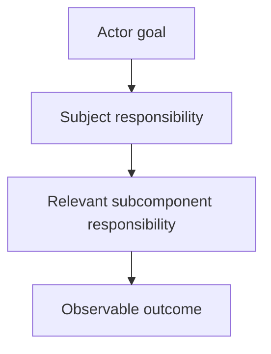

# Designing Mermaid Diagrams - as-is

## Purpose
Design bounded Mermaid diagrams that make a component's purpose, immediate
subcomponents, responsibilities, relationships, interactions, boundaries,
consequential flows, and observable outcomes understandable to readers without
implementation knowledge.

## Design

The skill selects a generic Mermaid representation based on the reader's
question and keeps authoritative context in prose. It owns Mermaid diagram
mechanics, diagram-type selection, and communication guidance for generic
subjects, including the distinction between source-level and optional
renderer-backed navigation checks, a pre-render layout plan, and the preference
for taller, narrower ELK/TB flowcharts when they improve readability. The plan
captures the available render surface, intended shape, density budget, grouping
and routing, and any supported exception before rendering. The host document's
owning procedure decides whether a node requires a link; when it does, a
matching Markdown fallback preserves navigation if a renderer suppresses the
diagram link rather than replacing it. That fallback is distinct navigation,
not a reason to duplicate the target or ordinary direct-child contract in a
separate link catalog. Repository-specific record structure and breadcrumb
navigation belong to the host document's owning procedure. Renderer-backed
checks accept diagram sources in bounded batches; document discovery remains
caller-owned, and the checks do not install providers or contact external
services.

[as-is](../../as-is.md#design) / [Skills](../as-is.md#design) / **Designing Mermaid Diagrams**

### Generic outcome flow

- Pre-render layout plan: repository Markdown consumers with no fixed dimensions or configured renderer; taller-than-wide outcome flow; four short-labeled nodes and three edges; top-to-bottom routing expresses outcome progression; renderer-specific geometry remains untested.

## Boundary

The skill owns reusable diagram design and validation guidance. The owning
component record owns the meaning and authority of its purpose, boundaries,
and relationships. This skill does not own component behavior, task authority,
agent selection, context resolution, or architectural decisions.

## Links

- [SKILL.md](SKILL.md) — authoritative procedure and Mermaid type-selection guidance.
- [rendered-navigation.md](rendered-navigation.md) — repository-local optional browser-batch input and evidence contract.
- [../managing-as-is-document/SKILL.md](../managing-as-is-document/SKILL.md) — host-specific as-is diagram conventions are owned outside this generic skill.
