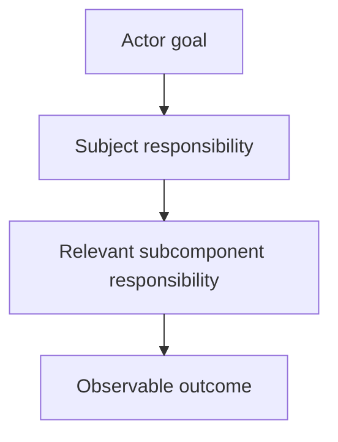

# Designing Mermaid Diagrams - as-is

## Purpose
Design bounded Mermaid diagrams that make a component's purpose, immediate
subcomponents, responsibilities, relationships, interactions, boundaries,
consequential flows, and observable outcomes understandable to readers without
implementation knowledge.

## Design

| Concern | Rule |
| --- | --- |
| Representation | Select the generic Mermaid view from the reader's question and keep authoritative context in prose. |
| Owned mechanics | Own Mermaid mechanics, diagram-type selection, and communication guidance for generic subjects. |
| Navigation | The host procedure decides whether nodes require links; a required Markdown fallback preserves navigation when a renderer suppresses a diagram link. |
| Duplication | A fallback is distinct navigation, not a reason to duplicate targets or ordinary direct-child contracts in a separate catalog. |
| Host conventions | Repository-specific record structure and `**Lineage**: ` navigation belong to the host procedure. |
| Rendering | Renderer checks accept bounded diagram-source batches; callers own document discovery; checks install no providers and contact no external services. |
| Layout planning | Keep render planning in working context for critical views, not canonical records. |

**Lineage**: [as-is](../../as-is.md#design) / [Skills](../as-is.md#design) / **Designing Mermaid Diagrams**

### Generic outcome flow

The skill owns reusable diagram design and validation guidance. The owning
component record owns the meaning and authority of its purpose, boundaries,
and relationships. This skill does not own component behavior, task authority,
agent selection, context resolution, or architectural decisions.
## Links

- [SKILL.md](SKILL.md) — authoritative procedure and Mermaid type-selection guidance.
- [rendered-navigation.md](rendered-navigation.md) — repository-local optional browser-batch input and evidence contract.
- [../../docs/architecture-vocabulary.md#relationship-labels](../../docs/architecture-vocabulary.md#relationship-labels) — current-system relationship meanings consumed by as-is diagrams; generic Mermaid mechanics remain target-neutral.
- [../managing-as-is-document/SKILL.md](../managing-as-is-document/SKILL.md) — host-specific as-is diagram conventions are owned outside this generic skill.
