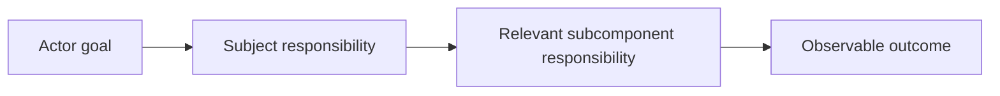

# Designing Mermaid Diagrams - as-is

## Purpose
Design bounded Mermaid diagrams that make a component's purpose, immediate
subcomponents, responsibilities, relationships, interactions, boundaries,
consequential flows, and observable outcomes understandable to readers without
implementation knowledge.

## Design

[Open Skills design](../as-is.md#design)

The skill selects a generic Mermaid representation based on the reader's
question and keeps authoritative context in prose. It owns Mermaid diagram
mechanics, diagram-type selection, and communication guidance for generic
subjects. Repository-specific record structure and navigation belong to the
host document's owning procedure.

Parent: [Skills](../as-is.md#design)

## Boundary

The skill owns reusable diagram design and validation guidance. The owning
component record owns the meaning and authority of its purpose, boundaries,
and relationships. This skill does not own component behavior, task authority,
agent selection, context resolution, or architectural decisions.

## Links

- [SKILL.md](SKILL.md) — authoritative procedure and Mermaid type-selection guidance.
- [../managing-as-is-document/as-is.md](../managing-as-is-document/as-is.md) — durable record and diagram placement guidance.
- [../managing-as-is-document/SKILL.md](../managing-as-is-document/SKILL.md) — host-specific as-is diagram conventions are owned outside this generic skill.
- [../as-is.md](../as-is.md) — skills component map.
