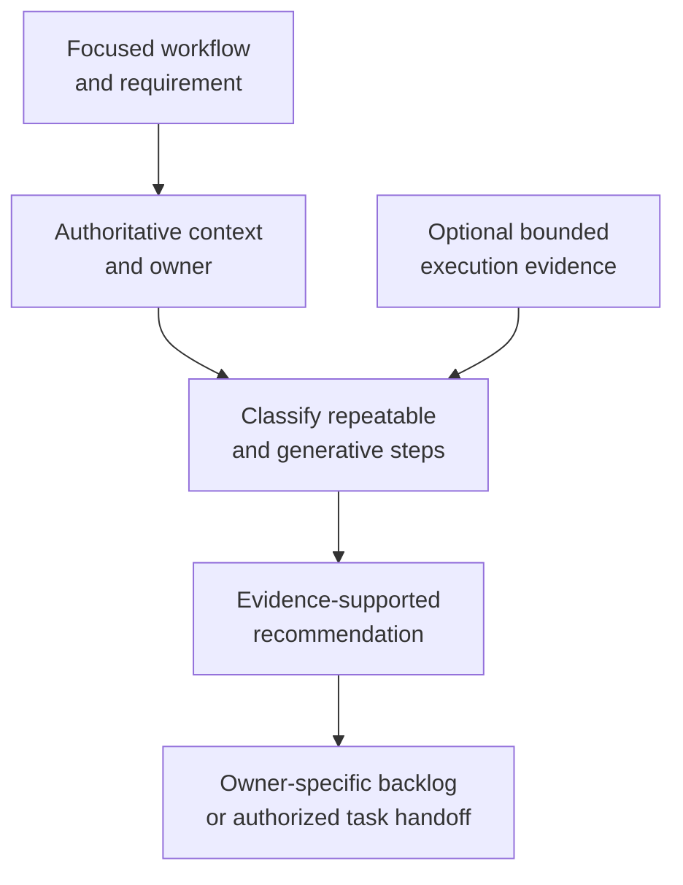

# deterministic-skills - as-is

## Purpose

Provide a reusable, evidence-based procedure for identifying bounded opportunities to make repeatable workflow behavior deterministic while preserving intentional generative judgment.

## Design

The skill separates evidence gathering and classification from implementation authority:

**Lineage**: [as-is](../../as-is.md#design) / [Skills](../as-is.md#design) / **deterministic-skills**

### Determinism assessment flow

The procedure is intentionally advisory. It may identify a deterministic candidate or recommend retaining a generative flow, but it does not edit source, mutate task or backlog authority, query unscoped sessions, select agents, or authorize implementation. Existing maintenance, execution-evidence, verification, and backlog skills remain the authoritative procedures for their respective concerns.

## Links

- [`SKILL.md`](SKILL.md) — bounded assessment procedure and authority boundaries.
- [`../maintaining-components/as-is.md#design`](../maintaining-components/as-is.md#design) — evidence-based component maintenance context.
- [`../exploring-execution-evidence/as-is.md#design`](../exploring-execution-evidence/as-is.md#design) — bounded execution-evidence context.
- [`../../docs/design-principles.md#execution-model-fit`](../../docs/design-principles.md#execution-model-fit) — repository execution-model principle.
