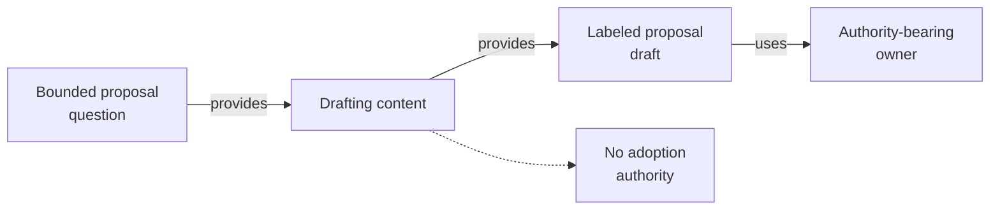

# Drafting Content - as-is

## Purpose
Produce a bounded proposal without claiming adoption or completion.

## Design
The skill states purpose, alternatives, assumptions, boundaries, and the next decision for a bounded proposal, keeping proposal content explicitly separate from current authority and labeled as draft. It is a reusable sibling in the proposal-and-decision family of skills (such as recording backlog items and presenting decisions): it produces the draft artifact while approval routing remains with the authority-bearing owner. It holds no adoption or completion authority, makes no parent-level or record changes, and grants no tools; it establishes fit for drafting proposals only.

**Lineage**: [as-is](../../as-is.md#design) / [Skills](../as-is.md#design) / **Drafting Content**

### Proposal drafting flow

## Links
- [SKILL.md](SKILL.md) — authoritative procedure and contract.
- [../as-is.md](../../as-is.md) — concise capability catalog entry.