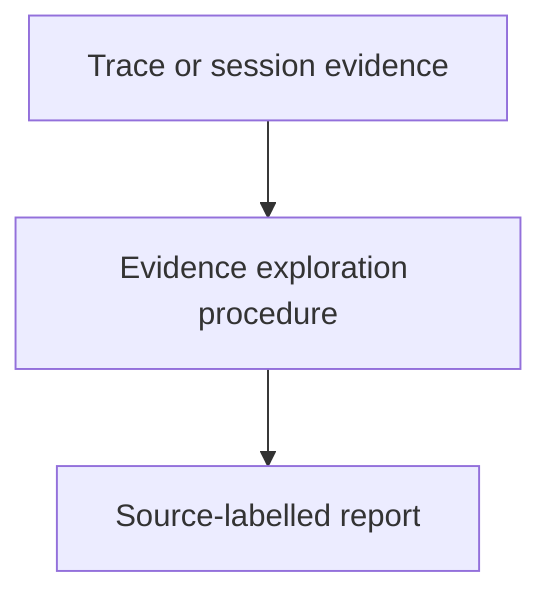

# Exploring Execution Evidence - as-is

## Purpose

Provide a reusable read-only procedure for using trace-query and readable
session-analysis tools to investigate a user-mentioned execution context and
produce decision-ready evidence for debugging, process improvement, or budget
analysis.

## Design

[Open Skills design](../as-is.md#design)

The component is organized around the following relationships and flow.

Parent: [Skills](../as-is.md#design)

- Start from a supplied trace or session selector and progressively inspect
  only the evidence needed for the question.
- Report source-labelled observations with explicit uncertainty.
- Treat session IDs as opaque correlation metadata.
- Keep runtime capture, task status, budgets, and allocation outside this skill.

## Boundary

This skill owns the investigation procedure and report contract. Observability
owns tracer implementation, while the worker extension owns bounded query
surfaces. Task records and the control plane remain authoritative for status,
validation, recovery, completion, limits, and allocation.

## Links

- [`SKILL.md`](SKILL.md) — authoritative procedure and output contract.
- [`../../agent-skills.md`](../../agent-skills.md) — concise capability catalog.
- [`../../components/observability/as-is.md`](../../components/observability/as-is.md) — trace ownership and boundaries.
- [`../../components/observability/tracing-design.md`](../../components/observability/tracing-design.md) — session-reference-first and privacy policy.
- [`../context-building/SKILL.md`](../context-building/SKILL.md) — bounded context and provenance procedure.
- [`../verification-discipline/SKILL.md`](../verification-discipline/SKILL.md) — evidence and residual-risk guidance.

## Changelog

- 2026-08-11: Renamed and broadened the execution-evidence skill to cover Pi session analysis alongside local traces. Session content remains outside normal trace payloads and task authority.
- 2026-08-12: Adopted filesystem ownership as the local session access boundary and restricted external trace correlation to opaque session IDs.
