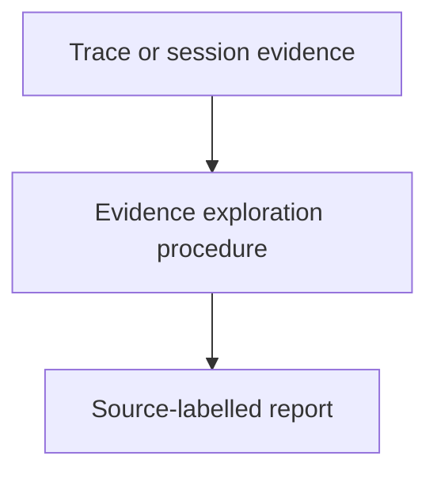
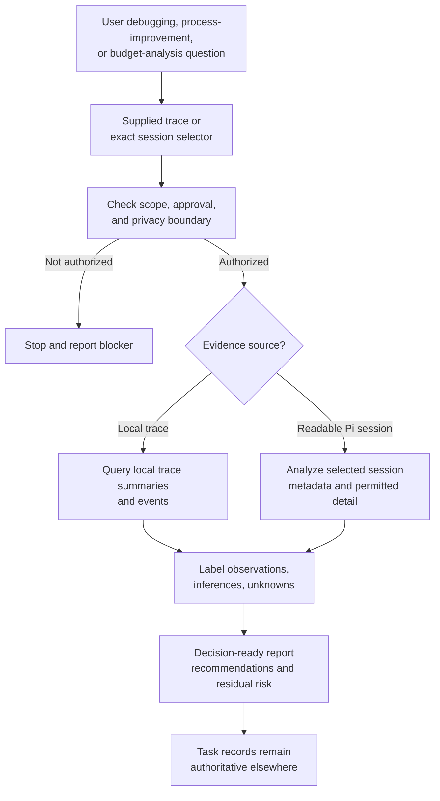

# Exploring Execution Evidence

## Purpose

Provide a reusable read-only procedure for using trace-query and readable
session-analysis tools to investigate a user-mentioned execution context and
produce decision-ready evidence for debugging, process improvement, or budget
analysis.

## Diagram

## Design

The skill starts from a supplied trace or session selector, progressively
queries local trace summaries, events, and selected session detail, and reports
source-labelled observations with explicit uncertainty. It treats session IDs
as opaque correlation metadata. It does not add runtime capture or replace
durable task and budget records. The external trace boundary carries the
session ID only.

The skill is a read-only evidence path: it begins with an explicit trace or
session reference, checks authorization and filesystem ownership, gathers only
permitted local evidence, and reports observations separately from inferences.
It does not add runtime capture, expose more than an external session ID,
or change task, budget, completion, or recovery authority.

## Boundaries

This skill owns the investigation procedure and report contract. The
observability component owns tracer implementation; the project worker
extension owns bounded query and session-analysis tools. Task records and the
control plane remain authoritative for status, validation, recovery, completion,
budget limits, and allocation. Session analysis remains exact-ID, read-only,
selector-driven, and governed by readable local Pi stores.

## Links

- [`SKILL.md`](SKILL.md) — authoritative procedure and output contract.
- [`../../agent-skills.md`](../../agent-skills.md) — concise capability catalog.
- [`../../components/observability/as-is.md`](../../components/observability/as-is.md) — trace ownership and boundaries.
- [`../../components/observability/tracing-design.md`](../../components/observability/tracing-design.md) — session-reference-first and privacy policy.
- [`../context-building/SKILL.md`](../context-building/SKILL.md) — bounded context and provenance procedure.
- [`../verification-discipline/SKILL.md`](../verification-discipline/SKILL.md) — evidence and residual-risk guidance.

## Changelog

- 2026-08-11: Renamed and broadened the execution-evidence skill to cover Pi session analysis alongside local traces. Session content remains outside normal trace payloads and task authority.
- 2026-08-12: Adopted filesystem ownership as the local session access boundary and restricted external trace correlation to opaque session IDs.
