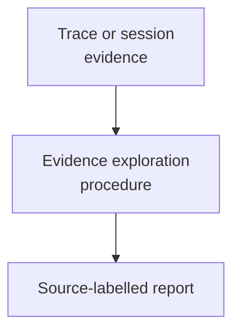

# Exploring Execution Evidence - as-is

## Purpose

Provide a reusable read-only procedure for using trace-query and readable
session-analysis tools to investigate a user-mentioned execution context and
produce decision-ready evidence for debugging, process improvement, or budget
analysis.

## Design

The component is organized around the following relationships and flow.

**Lineage**: [as-is](../../as-is.md#design) / [Skills](../as-is.md#design) / **Exploring Execution Evidence**

### Evidence Exploration Flow

| Concern | Rule |
| --- | --- |
| Investigation | Start from a supplied trace or session selector and inspect only evidence needed for the question. |
| Reporting | Use source-labelled observations with explicit uncertainty. |
| Correlation | Treat session IDs as opaque correlation metadata. |
| Excluded state | Keep runtime capture, task status, budgets, and allocation outside this skill. |
| Ownership | This skill owns investigation and reporting; observability owns tracing; the worker extension owns bounded query surfaces. |
| Authority | Task records and the control plane remain authoritative for status, validation, recovery, completion, limits, and allocation. |
## Links

- [`SKILL.md`](SKILL.md) — authoritative procedure and output contract.
- [`../as-is.md`](../as-is.md) — concise capability catalog.
- [`../../core/modules/observability/as-is.md`](../../core/modules/observability/as-is.md) — trace ownership and boundaries.
- [`../../core/modules/observability/tracing-design.md`](../../core/modules/observability/tracing-design.md) — session-reference-first and privacy policy.
- [`../reusable/building-context/SKILL.md`](../reusable/building-context/SKILL.md) — bounded context and provenance procedure.
- [`../reusable/validating-changes/SKILL.md`](../reusable/validating-changes/SKILL.md) — evidence and residual-risk guidance.
