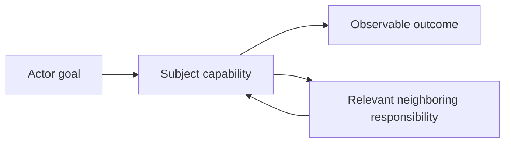
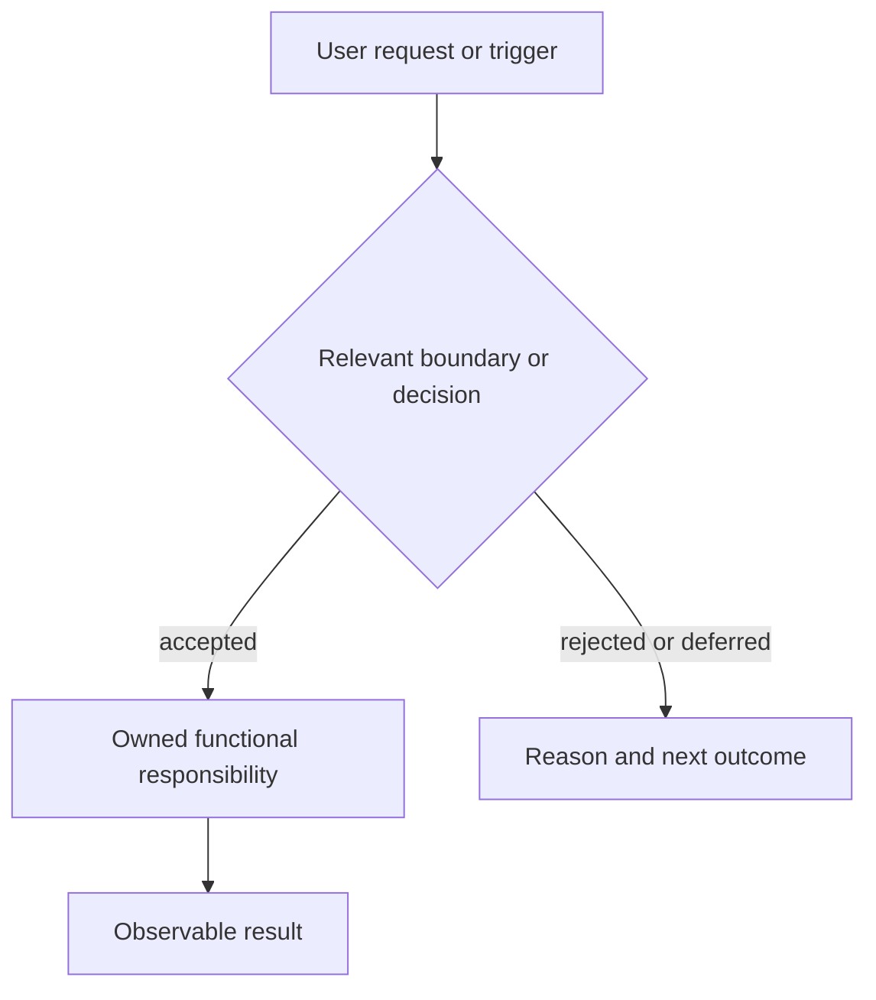

# Functional Context Diagrams

Create a diagram when a user, team, or agent needs to understand what a system
or component does, who it serves, where responsibility changes, or how a
bounded outcome flows through relevant responsibilities. The diagram is a
communication aid: authoritative purpose, boundaries, and decisions remain in
linked prose and records.

## Inputs

- A named subject and the decision, explanation, or handoff the diagram must
  support.
- The subject's authoritative purpose, responsibilities, boundaries, relevant
  actors, neighboring responsibilities, and outcomes.
- Explicit scope, audience, known assumptions, and any required repository
  links.

Do not infer missing responsibilities from implementation names or ambient
filesystem discovery. Ask for or record an unresolved assumption when the
source context does not support a relationship.

## Functional context

Represent the subject in terms of externally meaningful behavior:

- **Actors and goals:** who requests or depends on the outcome and what they
  need.
- **Responsibilities:** meaningful capabilities or decisions owned by the
  subject and relevant neighbors.
- **Boundaries:** where responsibility, authority, trust, or scope changes.
- **Flows:** requests, decisions, information, or outcomes between those
  responsibilities.
- **Outcomes:** observable results, rejected paths, or handoff states.

A functional diagram may name a role, record, or capability when it clarifies a
responsibility. It should not primarily explain process IDs, source modules,
container topology, deployment infrastructure, providers, protocols, or
internal data structures. Those belong in a technical diagram or focused
implementation documentation.

## Method

1. State the diagram's subject, audience, purpose, and bounded outcome.
2. Extract supported actors, goals, responsibilities, boundaries, flows, and
   outcomes from authoritative context. Label assumptions and unknowns.
3. Select the smallest useful view: context map for neighboring responsibilities,
   flow diagram for a bounded journey, or boundary diagram for ownership and
   authority.
4. Name nodes with functional nouns or roles. Use meaningful labels rather
   than implementation filenames. Keep only nodes and edges needed for the
   stated purpose.
5. Draw the primary path first, then add only consequential alternate,
   rejected, or recovery paths. Use notes or prose for details that would make
   the diagram dense.
6. Add repository-relative links only when they resolve from the document's
   location and provide necessary navigation. Prose remains authoritative if a
   diagram and prose diverge.
7. Validate that every node has a purpose, every edge has a supported meaning,
   boundaries are visible where responsibility changes, and technical detail
   has not displaced the functional view.

## Templates

### Functional context map

Use this for scope, responsibility, and relationship orientation. Replace the
placeholder labels with functional names and remove unused nodes.

### Bounded outcome flow

Use this for a single user journey or handoff. Keep implementation mechanics
out of the primary flow; link a separate technical view when needed.

## Output

Return or record:

- the diagram in Mermaid or another agreed readable notation;
- subject, audience, purpose, and scope;
- a short interpretation of the primary path and boundaries;
- source links or provenance for non-obvious relationships;
- assumptions, unknowns, and any omitted technical detail;
- validation result and residual risk.

## Checks

- The subject and intended outcome are explicit.
- Actors, responsibilities, relevant boundaries, and consequential outcomes
  are represented at the selected scope.
- Every edge expresses a supported functional relationship.
- Labels are understandable without knowing implementation filenames.
- Technical architecture is not presented as functional context.
- The diagram is bounded, readable, and consistent with authoritative prose.
- Mermaid syntax and repository-relative links pass the smallest applicable
  deterministic check.

## Stop and escalate

Stop rather than inventing a diagram when the authoritative purpose or boundary
is missing, sources contradict one another, the requested view would cross an
unauthorized component boundary, or the diagram would imply an unapproved
architecture or authority decision. Propose a separate technical diagram when
implementation detail is necessary to answer the user's question.

## Boundary

This skill designs and validates representations. It does not change component
behavior, grant authority, select or launch agents, resolve linked context, or
make architectural decisions on behalf of the owner.
