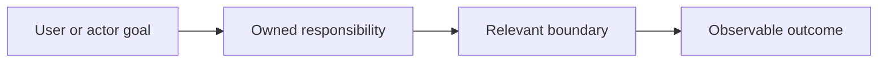

# Functional Context Diagrams

## Purpose
Design bounded functional-context diagrams that explain user goals,
responsibilities, boundaries, flows, and outcomes without replacing
authoritative component prose or confusing functional context with technical
architecture.

## Design

The skill extracts supported functional relationships and presents the
smallest useful view for its audience and decision.

## Boundary

The skill owns diagram design and validation guidance. It does not own
component behavior, task authority, agent selection, context resolution, or
architectural decisions.

## Links

- [SKILL.md](SKILL.md) — authoritative procedure and templates.
- [../structuring-as-is-records/as-is.md](../structuring-as-is-records/as-is.md) — durable record and diagram placement guidance.
- [../as-is.md](../as-is.md) — skills component map.
