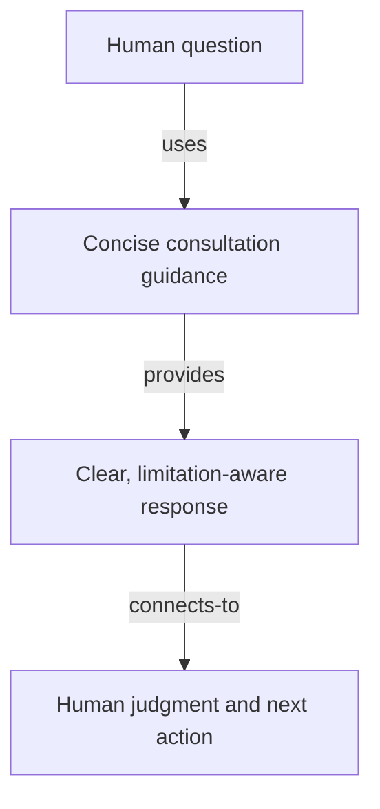

# Human-Centered Consulting - as-is

## Purpose

Provide reusable guidance for concise, agency-preserving consultation that helps people understand questions, weigh bounded alternatives, and identify safe next actions.

## Design

The skill shapes consultation around direct conclusions, progressive disclosure, explicit uncertainty, material trade-offs, and the smallest necessary clarifying question. It preserves human responsibility and does not grant professional authority or task execution permission.

[as-is](../../as-is.md#design) / [Skills](../as-is.md#design) / **Human-Centered Consulting**

- Pre-render layout plan: use the repository Markdown render surface without assuming fixed dimensions; arrange four short-labeled nodes and three directed edges as a taller-than-wide TB/ELK-style progression from question through consultation to human judgment. Keep one ungrouped route; renderer geometry remains untested.

### Agency-preserving consultation

The procedure is used by human-facing roles such as the expert and thinking companion. Those agents retain authority over whether and how to apply the guidance; the skill does not select, authorize, or launch agents.

## Links

- [`SKILL.md`](SKILL.md) — authoritative consultation procedure.
- [`../../agents/expert/agent.md`](../../agents/expert/agent.md) — read-only advisory role.
- [`../../agents/thinking-companion/agent.md`](../../agents/thinking-companion/agent.md) — human-facing consultation role.
