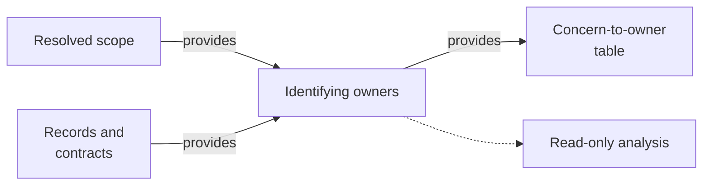

# Identifying Owners - as-is

## Purpose
Identify the authorities and owners for the resolved scopes.

## Design
The skill builds a concern-to-owner table covering implementation, task state, durable records, history, validation, delegation, and commits, verifying each owner from a record or contract and separating authority, consultation, and implementation responsibilities. It operates on scopes already resolved by its sibling scope-resolution skill and feeds owner identities to delegation and consultation skills; it traces concerns to canonical owners rather than assigning them itself. It is read-only analysis: it holds no task authority, does not edit owner records, and grants no tools; it establishes fit only.

**Lineage**: [as-is](../../as-is.md#design) / [Skills](../as-is.md#design) / **Identifying Owners**

### Owner-tracing flow

## Links
- [SKILL.md](SKILL.md) — authoritative procedure and contract.
- [../as-is.md](../../as-is.md) — concise capability catalog entry.