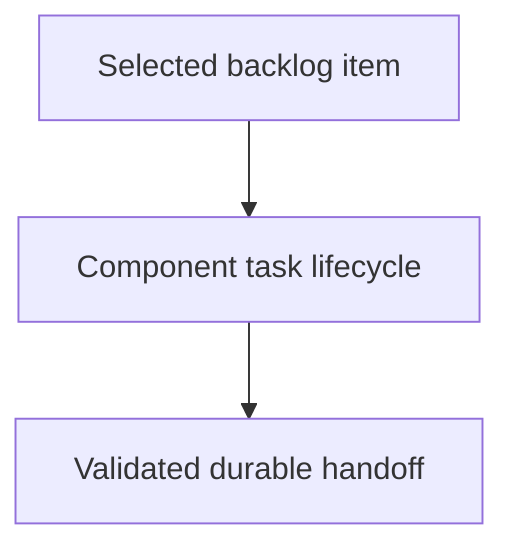

# Implementing Component Tasks - as-is

## Purpose

Provide the reusable implementation procedure for one bounded component task.

## Design

The component is organized around the following relationships and flow.

[as-is](../../as-is.md#design) / [Skills](../as-is.md#design) / **Implementing Component Tasks**

### Component task lifecycle flow

- Pre-render layout plan: Render on the Markdown Mermaid surface with no fixed width, height, or other dimensions. Preserve the top-to-bottom progression shape and prefer ELK layout where the renderer supports it; the source remains the existing `flowchart TD`. Keep the visible density to three nodes, two directed edges, and their existing labels. Use one linear route with no groups or subgraphs, and let the renderer perform normal edge routing. Renderer and ELK support are untested, so the final visual layout may vary despite valid Mermaid source.

This skill owns transient task creation, scoped implementation, child-boundary
delegation, deterministic validation, changelog handoff, and task cleanup.

## Links

- [SKILL.md](SKILL.md) — authoritative implementation procedure.
- [../../docs/component-task-record-protocol.md](../../docs/component-task-record-protocol.md) — task and component boundaries.
- [../managing-backlog/SKILL.md](../managing-backlog/SKILL.md) — task selection input.
