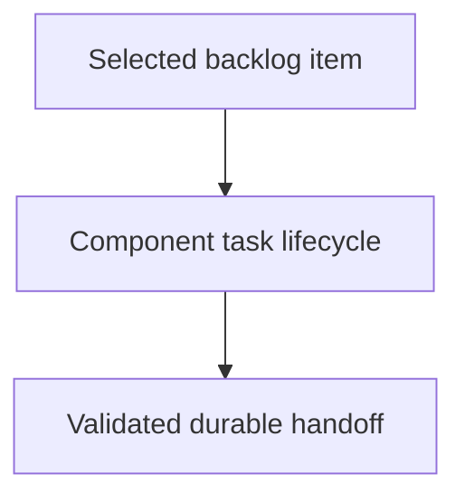

# Implementing Component Tasks - as-is

## Purpose

Provide the reusable implementation procedure for one bounded component task.

## Design

[Open Skills design](../as-is.md#design)

The component is organized around the following relationships and flow.

Parent: [Skills](../as-is.md#design)

This skill owns transient task creation, scoped implementation, child-boundary
delegation, deterministic validation, changelog handoff, and task cleanup.

## Links

- [SKILL.md](SKILL.md) — authoritative implementation procedure.
- [../../docs/component-task-record-protocol.md](../../docs/component-task-record-protocol.md) — task and component boundaries.
- [../managing-backlog/SKILL.md](../managing-backlog/SKILL.md) — task selection input.

## Changelog

- 2026-08-02: separated task implementation from backlog prioritization.
