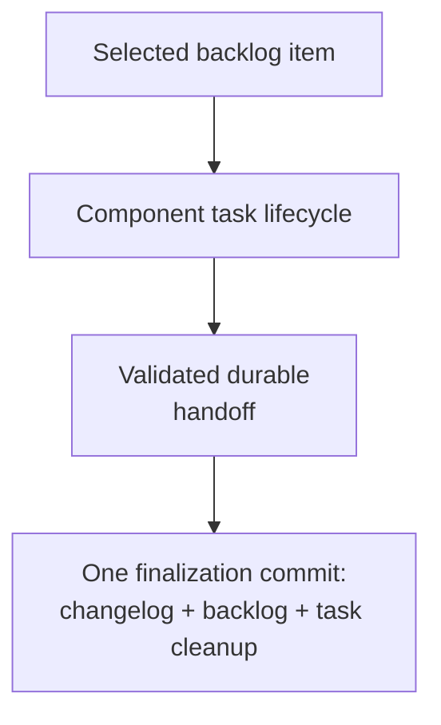

# Implementing Component Tasks - as-is

## Purpose

Provide the reusable implementation procedure for one bounded component task.

## Design

The component is organized around the following relationships and flow.

**Lineage**: [as-is](../../as-is.md#design) / [Skills](../as-is.md#design) / **Implementing Component Tasks**

### Component task lifecycle flow

This skill owns transient task creation, scoped implementation, child-boundary
delegation, deterministic validation, changelog handoff, and preparation of the
single completion finalization unit. The owning completion procedure commits
changelog evidence, exact backlog cleanup, task-artifact cleanup, and the
scoped durable handoff together.

## Links

- [SKILL.md](SKILL.md) — authoritative implementation procedure.
- [../../docs/component-task-record-protocol.md](../../docs/component-task-record-protocol.md) — task and component boundaries.
- [../managing-backlog/SKILL.md](../managing-backlog/SKILL.md) — task selection input.
