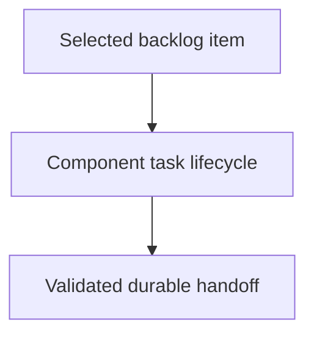

# Implementing Component Tasks

## Purpose

Provide the reusable implementation procedure for one bounded component task.

## Diagram

## Design

This skill owns transient task creation, scoped implementation, child-boundary
delegation, deterministic validation, changelog handoff, and task cleanup.

## Links

- `SKILL.md` — authoritative implementation procedure.
- `../../docs/component-task-record-protocol.md` — task and component boundaries.
- `../managing-backlog/SKILL.md` — task selection input.

## Changelog

- 2026-08-02: separated task implementation from backlog prioritization.
