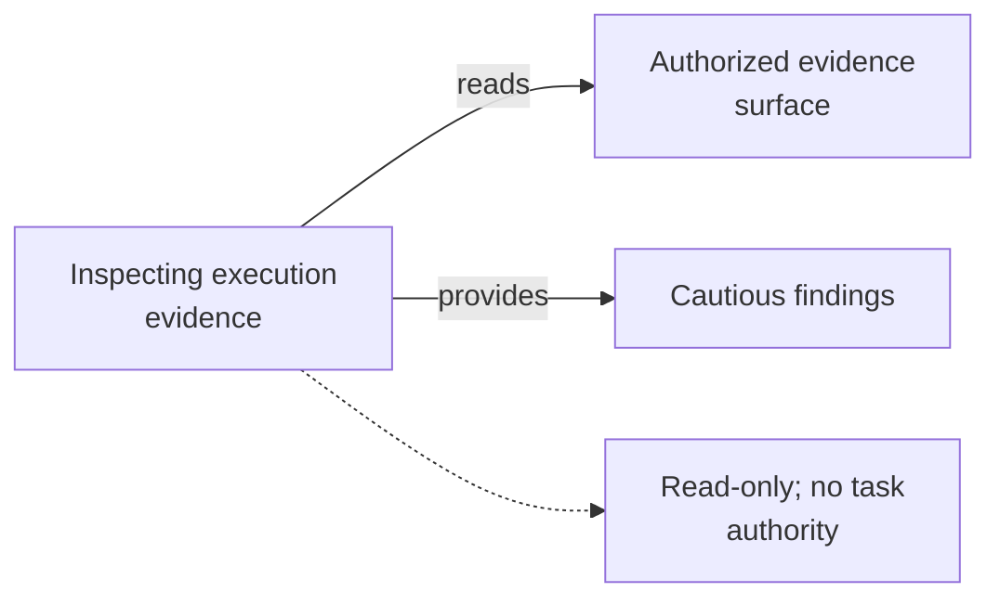

# Inspecting Execution Evidence - as-is

## Purpose
Investigate bounded traces, sessions, or execution results.

## Design
The skill reads only the authorized evidence surface using an exact selector and focused question, correlates bounded events, and reports observed facts, hypotheses, unknowns, and freshness separately. It is the reusable counterpart of the master execution-evidence exploration skill and composes with sibling observation and evidence-recording skills: it produces cautious findings, not authority. It is read-only investigation; it never uses evidence to authorize work or completion, holds no task authority, and grants no tools.

**Lineage**: [as-is](../../as-is.md#design) / [Skills](../as-is.md#design) / **Inspecting Execution Evidence**

### Evidence inspection flow

## Links
- [SKILL.md](SKILL.md) — authoritative procedure and contract.
- [../as-is.md](../../as-is.md) — concise capability catalog entry.