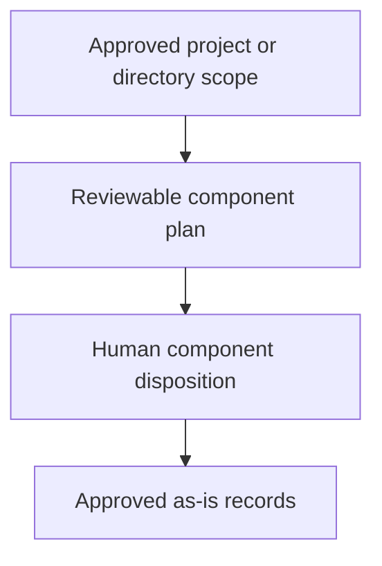

# Integrating As-Is Documentation - as-is

## Purpose

Provide the reusable adoption procedure for introducing `as-is` records into an existing project through semantic component identification, human-reviewed decomposition, and bounded durable record creation.

## Design

This skill composes setup scope, candidate identification, naming, record management, and Mermaid representation without becoming an authority-bearing agent or replacing the individual record-management procedure.

Parent: [Skills](../as-is.md#design)

### Record-adoption flow

The integration flow produces a reviewable plan first, obtains human disposition for each candidate, then routes approved record creation through `managing-as-is-document`. Parent maps expose only immediate documented children; routine filesystem artifacts remain ordinary navigable content unless semantic evidence supports a component boundary. Linked structural-container child boxes are paired with Components-table Markdown fallback, so a renderer-independent route remains available without repeating the targets in Links. Nearby parent navigation and required fallback for separately linked diagrams provide their own routes. Source and test links need the explicit reader-facing or indispensable-behavior exception. Applicable diagrams use named diagram headings, nearby parent navigation, and the generic readable-layout guidance.

## Links

- [`SKILL.md`](SKILL.md) — authoritative integration procedure.
- [`../as-is-setup/SKILL.md`](../as-is-setup/SKILL.md) — scope selection and setup behavior.
- [`../managing-as-is-document/SKILL.md`](../managing-as-is-document/SKILL.md) — durable record lifecycle.
- [`../designing-mermaid-diagrams/SKILL.md`](../designing-mermaid-diagrams/SKILL.md) — generic Mermaid mechanics.
