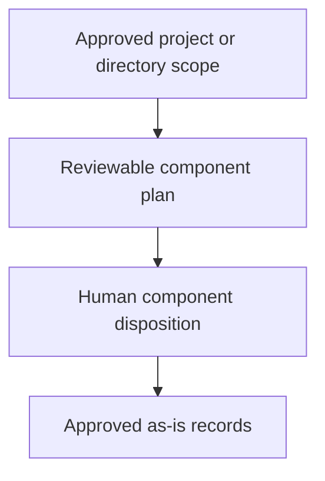

# Integrating As-Is Documentation - as-is

## Purpose

Provide the reusable adoption procedure for introducing `as-is` records into an existing project through semantic component identification, human-reviewed decomposition, and bounded durable record creation.

## Design

This skill composes setup scope, candidate identification, naming, record management, and Mermaid representation without becoming an authority-bearing agent or replacing the individual record-management procedure.

[as-is](../../as-is.md#design) / [Skills](../as-is.md#design) / **Integrating As-Is Documentation**

### Record-adoption flow

- Pre-render layout plan: repository Markdown consumers with no fixed dimensions or configured renderer; taller-than-wide adoption flow; four short-labeled nodes and three edges; top-to-bottom routing expresses adoption progression; renderer-specific geometry remains untested.

The integration flow produces a reviewable plan first, obtains human disposition for each candidate, then routes approved record creation through `managing-as-is-document`. Parent maps expose only immediate documented children; routine filesystem artifacts remain ordinary navigable content unless semantic evidence supports a component boundary. Linked structural-container child boxes are paired with the Components-table Markdown catalog and fallback, so a renderer-independent route remains available without repeating targets or ordinary direct-child contracts in Links. Root-to-current breadcrumbs and required fallback for separately linked diagrams provide their own routes. A projected host prompt without a canonical record remains an ordinary bundle artifact rather than a component candidate. Source and test links need the explicit reader-facing or indispensable-behavior exception. Target-local policy determines history placement and retention. Applicable diagrams use named diagram headings, root-to-current breadcrumbs, and the generic readable-layout guidance. The reviewable adoption plan captures each planned diagram's render-surface constraint, intended shape, density budget, grouping and routing direction, and any supported exception before rendering rather than discovering a wide layout afterward.

## Links

- [`SKILL.md`](SKILL.md) — authoritative integration procedure.
- [`../as-is-setup/SKILL.md`](../as-is-setup/SKILL.md) — scope selection and setup behavior.
- [`../managing-as-is-document/SKILL.md`](../managing-as-is-document/SKILL.md) — durable record lifecycle.
- [`../designing-mermaid-diagrams/SKILL.md`](../designing-mermaid-diagrams/SKILL.md) — generic Mermaid mechanics.
