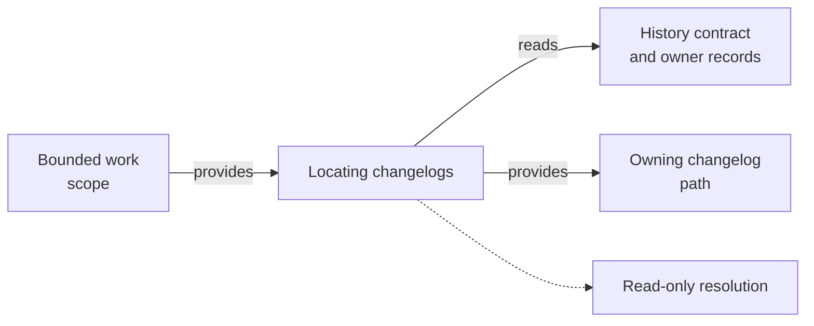

# Locating Changelogs - as-is

## Purpose
Resolve the changelogs owned by the target scopes.

## Design
The skill resolves the owning changelog for bounded work by reading the applicable history contract and ownership records before repository conventions, returning the exact path with rationale or an explicit statement that no history is required. It is the discovery counterpart to the sibling drafting-changelog-entries skill and serves the scoped-commit handoff: it resolves where durable history belongs, while drafting and commit procedures remain separate. It is read-only resolution; it never selects a changelog by proximity alone, holds no task authority, and grants no tools; it establishes fit only.

**Lineage**: [as-is](../../as-is.md#design) / [Skills](../as-is.md#design) / **Locating Changelogs**

### Changelog resolution flow

## Links
- [SKILL.md](SKILL.md) — authoritative procedure and contract.
- [../as-is.md](../../as-is.md) — concise capability catalog entry.