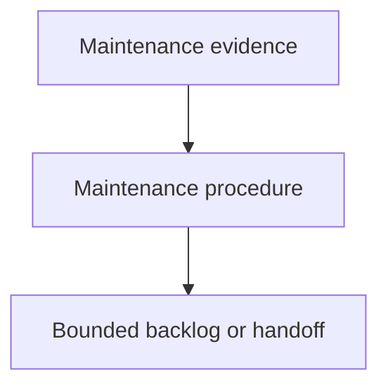

# Maintaining Components - as-is

## Purpose

Maintain the reusable `maintaining-components` skill as the durable backlog and
handoff record for evidence-based housekeeping work. This record captures the
current maintenance assignment without executing the audit itself.

## Design

The component is organized around the following relationships and flow.

[as-is](../../as-is.md#design) / [Skills](../as-is.md#design) / **Maintaining Components**

## Links

- [SKILL.md](SKILL.md) — authoritative procedure and contract.
