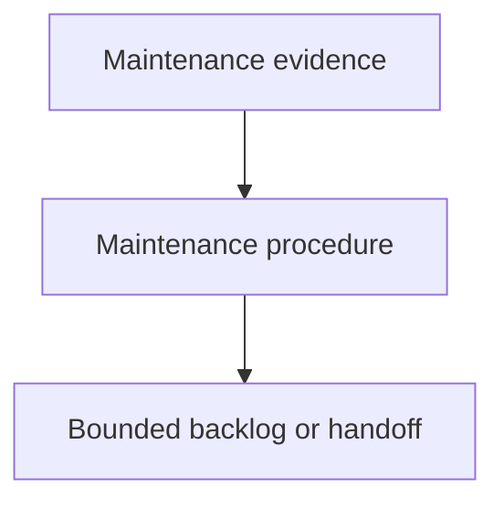

# Maintaining Components - as-is

## Purpose

Maintain the reusable `maintaining-components` skill as the durable backlog and
handoff record for evidence-based housekeeping work. This record captures the
current maintenance assignment without executing the audit itself.

## Design

The component is organized around the following relationships and flow.

[as-is](../../as-is.md#design) / [Skills](../as-is.md#design) / **Maintaining Components**

- Pre-render layout plan: The Markdown render surface has no fixed dimensions; use a taller, narrower top-to-bottom TB progression with ELK where supported. Keep the visible view sparse with three nodes, two directed edges, and short labels; group only the maintenance flow itself and route relationships downward. The renderer is untested, so Mermaid and ELK support remains residual risk.

### Maintenance evidence-to-handoff flow

## Links

- [SKILL.md](SKILL.md) — authoritative procedure and contract.
