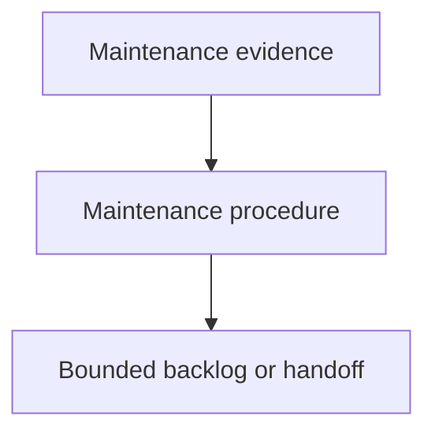

# Maintaining Components - as-is

## Purpose

Maintain the reusable `maintaining-components` skill as the durable backlog and
handoff record for evidence-based housekeeping work. This record captures the
current maintenance assignment without executing the audit itself.

## Design

The component is organized around the following relationships and flow.

Parent: [Skills](../as-is.md#design)

## Links

- [SKILL.md](SKILL.md) — authoritative procedure and contract.

## Changelog

- Created the missing `skills/maintaining-components/as-is.md` durable record.
- Preserved the existing skill ownership and recorded the first concrete
  maintenance backlog.
- Left the user's second backlog unspecified pending clarification instead of
  inventing an extra substantive item.
