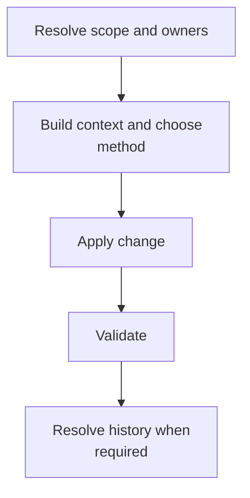

# Making Changes - as-is

## Purpose
Make and validate general changes with the smallest applicable scopes and history treatments.

## Design

The skill resolves scope and ownership, chooses the change method, composes the needed reusable skills, validates the result, and resolves durable history when required; it selects between the component-based variant (which hands execution to implementing-tasks and preserves the component task protocol, descendant closure, owning changelog, backlog reconciliation, and scoped completion handoff) and the non-component variant (which resolves artifact, project, or root authority and history contract without creating a component task). It establishes fit, not permission: it grants no tools or authority, may not inherit component-task or commit tools merely because another composition has them, must state why it omits a non-applicable reusable skill while preserving required gates, and stops on unresolved ownership or task applicability.

**Lineage**: [as-is](../../as-is.md#design) / [Skills](../as-is.md#design) / **Making Changes**

### Change composition flow

## Links
- [SKILL.md](SKILL.md) — authoritative procedure and contract.
- [../as-is.md](../../as-is.md) — concise capability catalog entry.