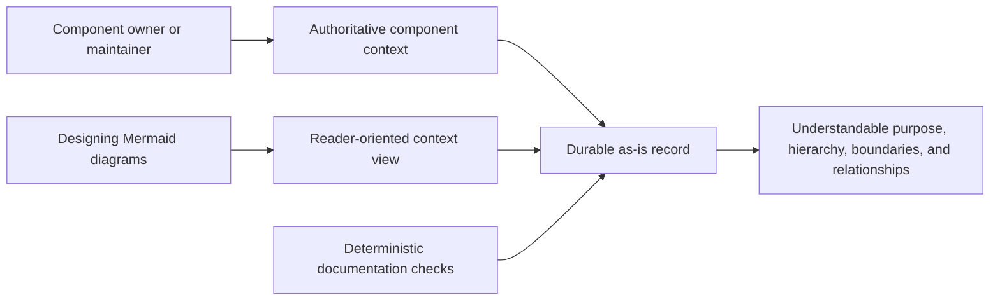

# Managing As-Is Documents - as-is

## Purpose

Maintain durable `as-is.md` records that explain the purpose, design, relationships, boundaries, hierarchy, and navigational context of repository components. This component provides the reusable procedure for creating, structuring, and maintaining those records without turning them into task, backlog, configuration, or runtime authorities.

## Design

The skill declares the durable record model, diagram and navigation model, example structure, creation, alignment, and replacement model, and compact ordered application model for an owned record. Initial-record, semantic-alignment, controlled-replacement, and migration-or-retirement treatments are selected from evidence about the approved component boundary and implementation context. It keeps authoritative purpose, boundaries, relationships, and decisions in prose and direct links; diagrams provide a bounded reader-oriented view. Its consolidated diagram examples keep the parent-container convention, navigation fallback, and separately scoped non-container views together. It composes with the generic Mermaid diagram design skill for Mermaid mechanics, functional framing, clear labels, readability, and technical-detail limits.

Parent: [Skills](../as-is.md#design)

The record shape uses Purpose, optional immediate Components, Design, optional Relationships, focused ownership facts when needed, and direct context links. A parent record's Design begins with its box-oriented container diagram; non-parent records do not receive container diagrams. A component boundary is the directory containing `as-is.md`; child records are explicit components, while ordinary directories and grandchildren are not promoted into the record. Parent context is never ambient: direct durable links provide a bounded child handoff.

This skill is used by agents and orchestrators that maintain component context; it does not select, authorize, start, observe, recover, cancel, or delegate agents. The existing orientation utility is read-only supporting infrastructure, not an authority-bearing workflow.

`content-test.ts` validates the stable documentation contract, and `scripts/orient.test.ts` exercises only read-only orientation support; no live test can exercise record-maintenance execution because its supported interface is repository-authored Markdown rather than an executable API. Residual risk: focused structural and link inspection cannot prove agent interpretation or renderer-specific diagram behavior.

## Links

- [SKILL.md](SKILL.md) — authoritative declarative record, creation, alignment, replacement, and compact ordered application models, plus linked diagram references.
- [diagram-examples.md](diagram-examples.md) — consolidated structural-container, navigation-fallback, and separately scoped diagram-view examples.
- [backlog.md](backlog.md) — pending as-is-specific vocabulary, view, and validation work; this repository configures `backlog.md` as the planning-record filename.
- [scripts/orient.ts](scripts/orient.ts) — compact read-only repository task snapshot.
- [scripts/orient.test.ts](scripts/orient.test.ts) — focused orientation tests.
- [content-test.ts](content-test.ts) — deterministic content validation for this skill's durable contract.
