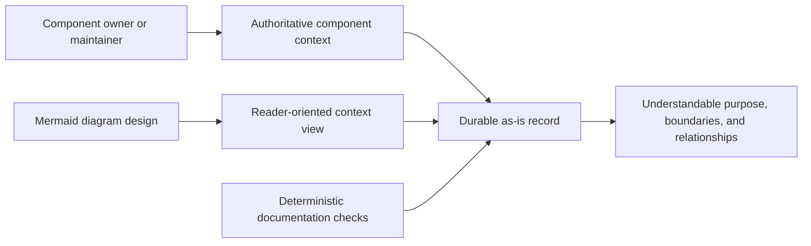

# Managing As-Is Documents

## Purpose
Maintain durable `as-is.md` records that explain the purpose, design,
relationships, boundaries, and navigational context of repository components.
This component provides the reusable procedure for creating and maintaining
those records without turning them into task, backlog, configuration, or
runtime authorities.

## Design

The skill inspects an owned record, preserves authoritative prose, and defines
what an `as-is.md` diagram must communicate: what the component does, its
actors, meaningful subcomponents, responsibilities, relationships,
interactions, boundaries, authority changes, consequential flows, and outcomes.
It invokes the generic Mermaid diagram-design skill for Mermaid mechanics,
functional framing, clear labels, readability, and technical-detail limits.
It validates links and structure before recording completed durable changes in
the owning changelog.

## Relationships

This skill is used by agents and orchestrators that maintain component context;
it does not select, authorize, or launch them. It composes with the generic
[Mermaid diagram design skill](../mermaid-diagram-design/as-is.md): this skill
owns the as-is-specific meaning and the Mermaid skill owns reusable diagram
mechanics. It also composes with
[structuring-as-is-records](../structuring-as-is-records/as-is.md) for the
canonical record shape. The existing orientation utility is a read-only
supporting script, not an authority-bearing workflow.

## Boundary

This component owns the `managing-as-is-document` procedure, its durable record,
and its existing `scripts/` utilities. It does not own component behavior,
agent authority, task lifecycle, backlog prioritization, or Mermaid diagram
semantics beyond applying the reusable diagram-design skill to `as-is.md`
records. The scripts remain in place and are not duplicated or moved.

## Links

- [SKILL.md](SKILL.md) — authoritative procedure, boundaries, outputs, and checks.
- [../mermaid-diagram-design/SKILL.md](../mermaid-diagram-design/SKILL.md) — selects the appropriate Mermaid representation; this skill owns its as-is application.
- [scripts/orient.ts](scripts/orient.ts) — compact read-only repository task snapshot.
- [scripts/orient.test.ts](scripts/orient.test.ts) — focused orientation tests.
- [../mermaid-diagram-design/as-is.md](../mermaid-diagram-design/as-is.md) — Mermaid diagram-design component context.
- [../structuring-as-is-records/as-is.md](../structuring-as-is-records/as-is.md) — canonical durable record guidance.
