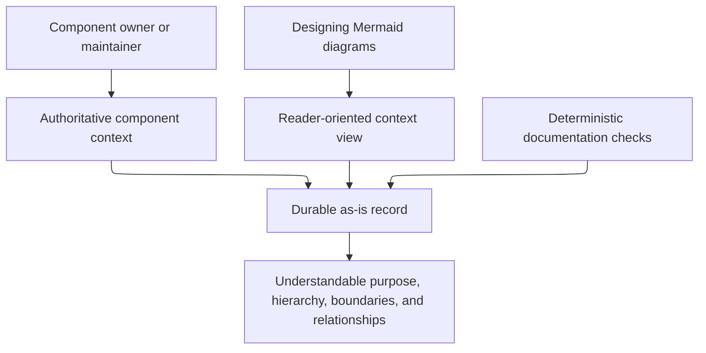

# Managing As-Is Documents - as-is

## Purpose

Maintain durable `as-is.md` records that explain the purpose, design, relationships, boundaries, hierarchy, and navigational context of repository components. This component provides the reusable procedure for creating, structuring, and maintaining those records without turning them into task, backlog, configuration, or runtime authorities.

## Design

The skill declares the durable record model, diagram and navigation model, controlled relationship vocabulary, example structure, creation, alignment, and replacement model, and compact ordered application model for an owned record. Initial-record, semantic-alignment, controlled-replacement, and migration-or-retirement treatments are selected from evidence about the approved component boundary and implementation context. Its optional hierarchical reconciliation application mode admits a parent only from its own allowed evidence and final immediate-child records for one baseline; it keeps the canonical record graph and task-control topology separate. It keeps authoritative purpose, boundaries, relationships, and decisions in prose and direct links; diagrams provide bounded reader-oriented views. Its consolidated diagram examples keep the parent-container convention, named diagram subsections, `**Lineage**: ` navigation, navigation fallback, and separately scoped non-container views together. It composes with the generic Mermaid diagram design skill for Mermaid mechanics, functional framing, optional working layout plans for critical views, clear labels, readable layouts, and technical-detail limits. Working render plans do not belong in canonical records.

**Lineage**: [as-is](../../as-is.md#design) / [Skills](../as-is.md#design) / **Managing As-Is Documents**

### Record-maintenance context flow

| Record concern | Rule |
| --- | --- |
| Shape | Use Purpose, optional Components, Design, optional Relationships, focused ownership facts when needed, and distinct Links. |
| Parent Design | Begin with a box-oriented container diagram; non-parent records do not receive container diagrams. |
| Component boundary | The directory containing `as-is.md` defines the component; child records are explicit components, while ordinary directories and grandchildren are not promoted. |
| View meaning | Structural views explain containment or neighborhood; temporal views explain one bounded consequential flow. |
| Flow threshold | Disclose material failure or recovery without turning routine implementation into architecture. |
| Task state | Keep active task state in the configured task record; follow the target project's history convention for history. |
| Navigation | Pair linked child boxes with the Components table; use `**Lineage**: ` and Markdown fallbacks for their own routes; add only distinct Links context. |
| Source and tests | Omit them unless exact behavior is indispensable and no equivalent prose exists.

This skill is used by agents and orchestrators that maintain component context; it does not select, authorize, start, observe, recover, cancel, or delegate agents. The existing orientation utility is read-only supporting infrastructure, not an authority-bearing workflow.

`content-test.ts` validates the stable documentation contract, including the controlled relationship vocabulary and provider-disclosure guidance, strict canonical titles, parent-only structural-container scope, immediate-child and sibling-arrow declarations, resolving `#design` links, `**Lineage**: ` lines, sole Components-table child catalogs, linked-node fallback pairs, parent-Link catalog exclusions, and the cross-skill optional working-layout-plan contract; it also exposes the bounded source-level diagram inputs that a caller may pass to the separate optional browser renderer. `scripts/orient.test.ts` exercises only read-only orientation support; no live test can exercise record-maintenance execution because its supported interface is repository-authored Markdown rather than an executable API. Residual risk: source-level checks do not prove Mermaid parsing, rendered geometry, renderer-specific SVG href behavior, or agent interpretation; browser checks remain optional, caller-owned, and non-critical unless a task explicitly elevates them.

## Links

- [SKILL.md](SKILL.md) — authoritative declarative record, creation, alignment, replacement, and compact ordered application models, plus linked diagram references.
- [../../docs/architecture-vocabulary.md#relationship-labels](../../docs/architecture-vocabulary.md#relationship-labels) — current-system definitions for canonical records, containment, authority, evidence, and relationship labels.
- [diagram-examples.md](diagram-examples.md) — consolidated structural-container, navigation-fallback, and separately scoped diagram-view examples.
